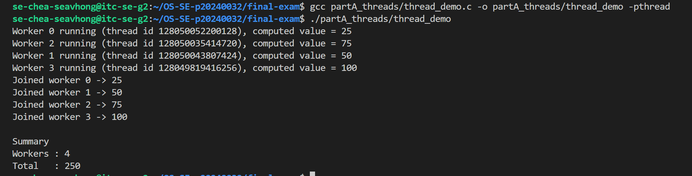
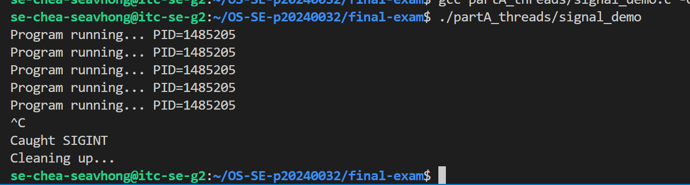
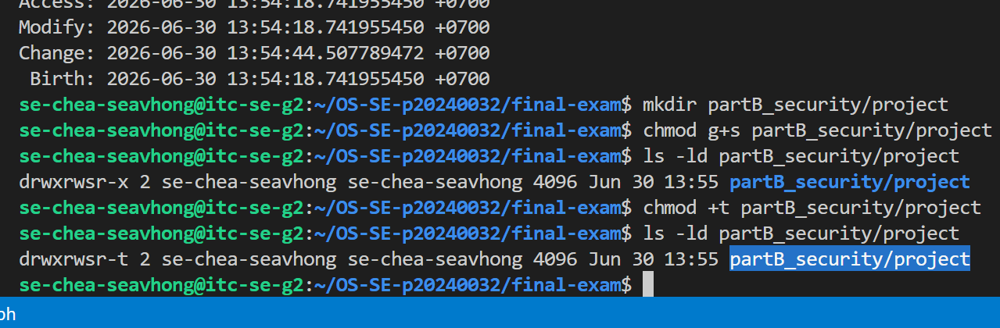
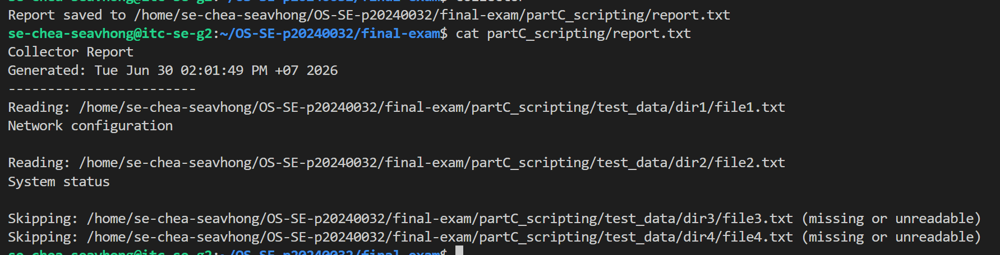
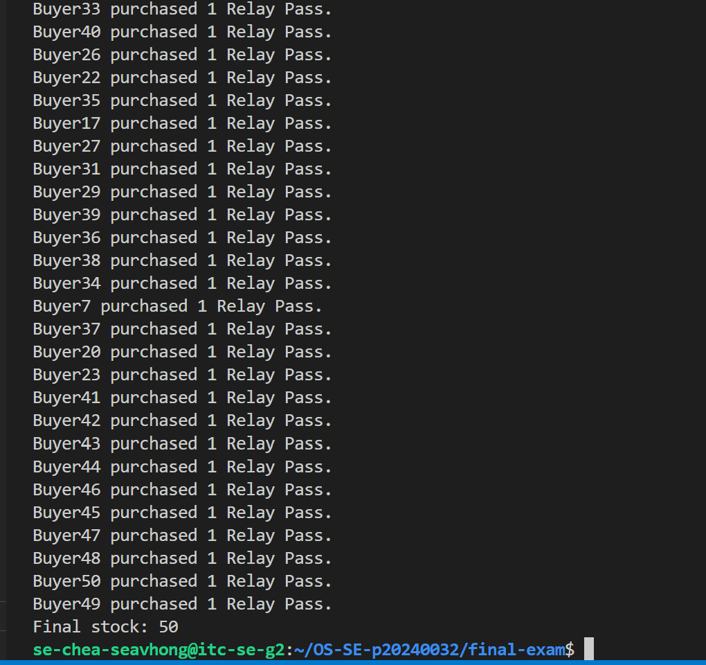
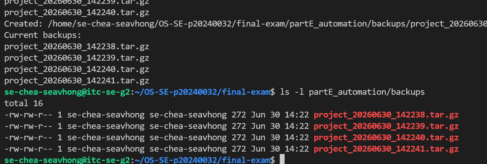

# Final Exam — <Your Name>

<!-- ===== COVER SHEET — required first section. Fill EVERY line. ===== -->
```
Student name: Chea Seavhong
Student ID: p20240032
Server username: se-chea-seavhong
Exam scenario value (COMPANY / PRODUCT): relay_pass
Date & start time: 2026-06-30 14:00
AI assistant used (name/none): ChatGPT
```

> Exact commands per part are in `commands.md`. Live-curveball answers are in `live_mods.md`.
> Replace every `<...>` below. Keep answers tied to **your own** scenario numbers.

---

## Part A — Threads, Kernel Mapping & Signals

**Screenshots**




**Written (one short answer)**

- **Why does a worker thread's joined result reach the main thread, but a forked
  child's value would not?**
  Threads share a single virtual address space, meaning the joined pointer value is read directly from shared memory. A forked child process executes in a duplicated, isolated address space via copy-on-write; therefore, any modifications it makes to variables or memory addresses never propagate back to the parent process.

**Anything not completed:** <none / ...>

---

## Part B — Files, Permissions & Special Bits

**Screenshot**



**Written (one short answer)**

- **Translate your private file's final octal mode into the 9-char symbolic string**
  (e.g. `600` → `rw-------`).
  octal 600 → rw-------

**Anything not completed:** <none / ...>

---

## Part C — Bash Scripting, PATH & Safe File Scanning

**Screenshot**



**Written (one short answer)**

- **Why did `greeter` fail to run by name before you added your `bin` directory to
  PATH?**
  Why did greeter fail to run by name before you added your bin directory to PATH?
The shell only searches for executables within the explicit directories listed in the $PATH environment variable. Adding ~/bin to $PATH allowed the shell's command resolution engine to locate and execute the bare name greeter.

**Anything not completed:** <none / ...>

---

## Part D — Concurrency, a Race Condition & File Locking

**Screenshot**



**Written (one short answer)**

- **Why did the unpatched `swarm` sometimes leave more stock than the correct final
  value (with `<INITIAL_STOCK>` stock and `<SWARM_SIZE>` concurrent buyers)?**
  Concurrent buyer processes reading the stock.txt file simultaneously experienced a "lost update" race condition. They read the same stale initial stock level, decremented it in parallel, and wrote back identical values—effectively overwriting each other's updates and applying fewer net decrements than expected.

**Anything not completed:** <note here if the race was hard to reproduce — D3's lock is
what's graded>

---

## Part E — Backups, Archiving & cron Automation

**Screenshot**



**Written (one short answer)**

- **Archiving vs compression — which one actually shrank the bytes, and why?**
 Archiving vs compression — which one actually shrank the bytes, and why?
tar handles archiving by bundling multiple separate files and their metadata into a single sequential stream without modifying file sizes. gzip performs the actual compression by running a Lempel-Ziv (LZ77) reduction algorithm over that stream, which replaces redundant data patterns to shrink the total byte footprint

**Anything not completed:** <none / ...>
