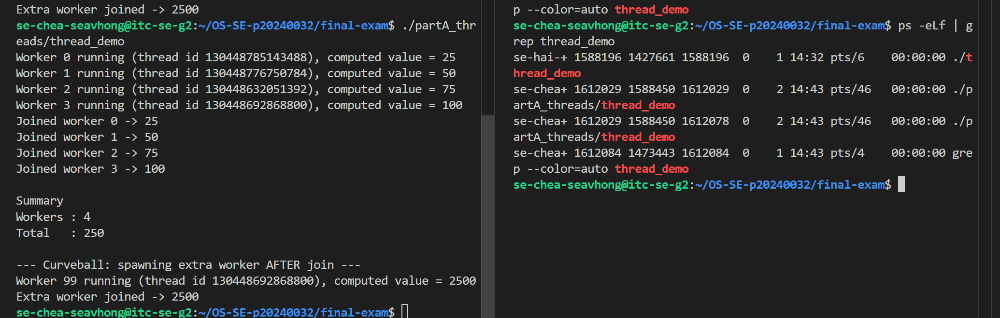
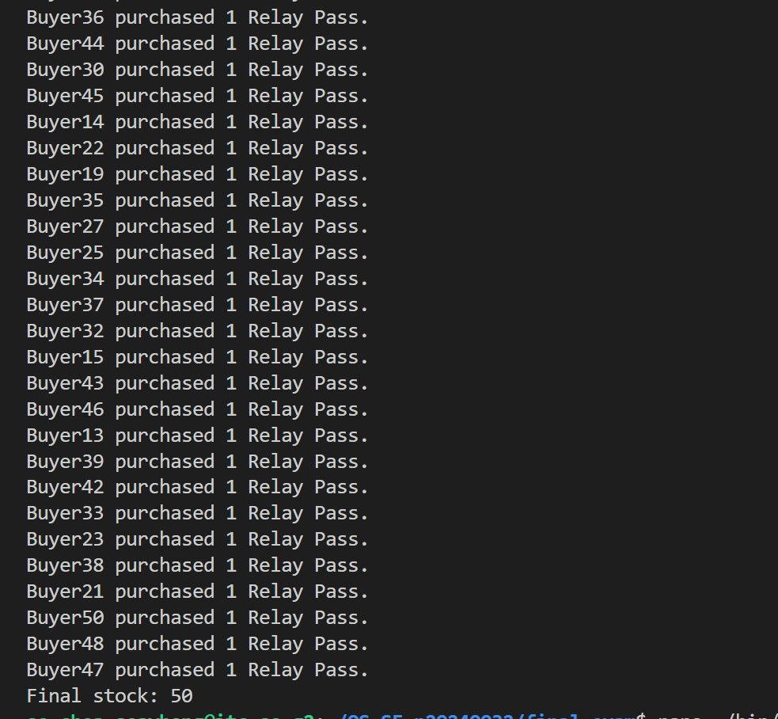
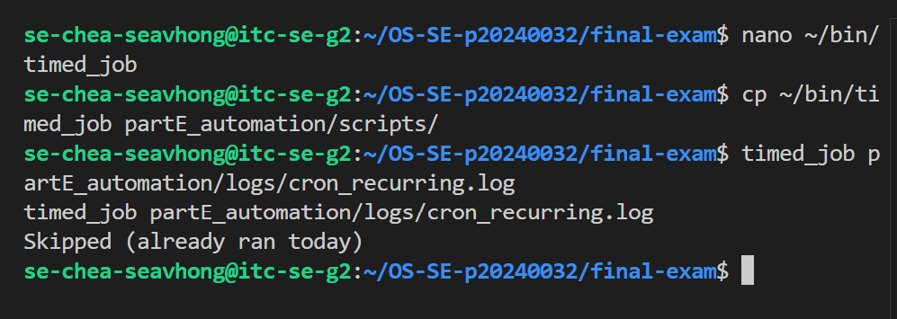

# live_mods.md — Live Modification (curveball) answers

> Released once, late in the exam. **Three curveballs: A, D, E.** For EACH, give: the
> announced instruction, the exact command(s) you ran, the **live value(s)** you acted
> on (your PID / stock / timestamp), and the screenshot. An answer that ignores your
> issued value, or that could have been written *before* the announcement, scores zero.

---

## Curveball A — extra worker(s) that start after the others join

- **Issued value:** `1` extra worker(s)
- **Announced instruction:** <paste exactly what was announced>
- **Live value(s) I acted on:** base PID = `1483379`; new LWP id(s) that appeared = `130448692868800`
- **Commands:**

```bash
# edit thread_demo.c to spawn N extra workers only AFTER the originals join
# recompile, run, and capture the mapping showing the new LWP(s) appear then vanish
gcc partA_threads/thread_demo.c -o partA_threads/thread_demo -pthread
./partA_threads/thread_demo &
ps -ef | grep thread_demo
ps -T -p 1483379
ps -eLf | grep 1483379
ps -T -p 1483379 > partA_threads/thread_map.txt
cat partA_threads/thread_map.txt
```

- **Screenshot:**



---

## Curveball D — per-buyer purchase cap

- **Issued value:** cap = `7`
- **Announced instruction:** Implement a strict per-buyer limit within your transaction system. Modify the buy_relay_pass binary script to evaluate incoming order sizes: if an individual request exceeds a cap of 7 units, explicitly reject the order, log the rejection details, and ensure the shared stock inventory remains unchanged
- **Live value(s) I acted on:** stock before = `100`; order(s) rejected for exceeding
  the cap = `8`; final stock = `58`
- **Commands:**

```bash
# add a per-buyer cap to buy_<product>: reject any single order above <N>
# reset stock, re-run swarm, show it stays consistent AND respects the cap
nano ~/bin/buy_relay_pass
cp ~/bin/buy_relay_pass partD_secure/scripts/
echo 100 > partD_secure/stock.txt
swarm
nano ~/bin/buy_relay_pass
cp ~/bin/buy_relay_pass partD_secure/scripts/
echo 100 > partD_secure/stock.txt
swarm
```

- **Screenshot:**



---

## Curveball E — idempotent timed_job

- **Issued value:** token = `TOKEN_2026_E`
- **Announced instruction:** Enforce strict idempotency rules on the cron automation suite. Modify the timed_job script with a defensive guard condition. The script must inspect the target log file; if a line containing the token 'TOKEN_2026_E' for the current calendar date is already found, the script must gracefully terminate and skip its routine execution block
- **Live value(s) I acted on:** today's marker line = `2026-06-30 TOKEN_2026_E`; 1st trigger = ran,
  2nd trigger = skipped
- **Commands:**

```bash
# add a guard to timed_job: refuse to run if today's <TOKEN> entry is already in the log
# trigger it twice and show the 2nd run was skipped
# add a per-buyer cap to buy_relay_pass: reject any single order above 7
# add a guard to timed_job: refuse to run if today's TOKEN_2026_E entry is already in the log
nano ~/bin/timed_job
chmod +x ~/bin/timed_job
cp ~/bin/timed_job partE_automation/scripts/
timed_job partE_automation/logs/cron_recurring.log
timed_job partE_automation/logs/cron_recurring.log
```

- **Screenshot:**

