# Class Activity 1 — System Calls in Practice

- **Student Name:** Chea Seavhong
- **Student ID:** p20240032
- **Date:** March 28, 2026

---

## Warm-Up: Hello System Call

Screenshot of running `hello_syscall.c` on Linux:

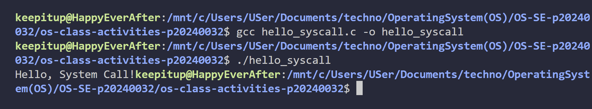

Screenshot of running `hello_winapi.c` on Windows (CMD/PowerShell/VS Code):

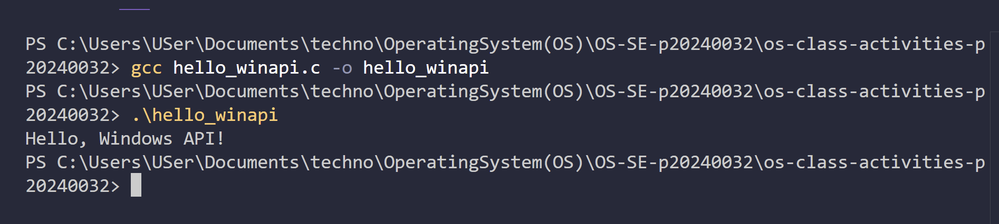

Screenshot of running `copyfilesyscall.c` on Linux:

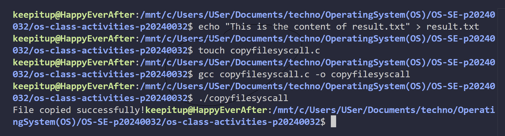

---

## Task 1: File Creator & Reader

### Part A — File Creator

**Describe your implementation:**  
I did both versions one with the C library and one with syscalls the library one is easier cause it does a lot for you like buffering and formatting but with syscalls I have do everything myself like permissions and turning numbers into strings

**Version A — Library Functions (`file_creator_lib.c`):**

<!-- Screenshot: gcc -o file_creator_lib file_creator_lib.c && ./file_creator_lib && cat output.txt -->
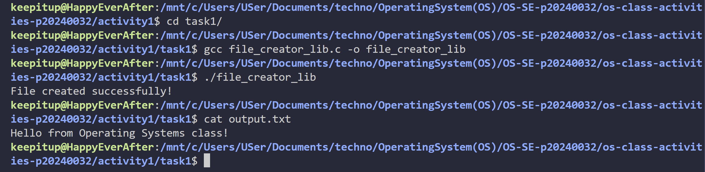

**Version B — POSIX System Calls (`file_creator_sys.c`):**

<!-- Screenshot: gcc -o file_creator_sys file_creator_sys.c && ./file_creator_sys && cat output.txt -->
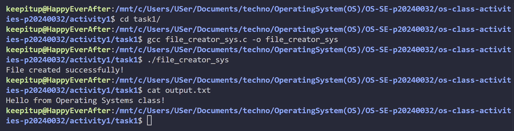

**Questions:**

1. **What flags did you pass to `open()`? What does each flag mean?**

   > in open("output.txt", O_WRONLY | O_CREAT | O_TRUNC, 0644) I used O_WRONLY for writing O_CREAT to make the file if it doesn't exist and O_TRUNC to empty it if it does

2. **What is `0644`? What does each digit represent?**

   > that's file permissions 0 means octal 6 is rw- for owner 4 is r-- for group and 4 is r-- for others so owner can read and write everyone else just read

3. **What does `fopen("output.txt", "w")` do internally that you had to do manually?**

   > it opens the file for writing makes it if needed and empties it inside it calls open with the right flags and sets up FILE* for buffering which I had to do myself with syscalls

### Part B — File Reader & Display

**Describe your implementation:**  
I used both library functions fopen fgets fclose and syscalls open read close to read and show the file the library one is easier cause it does buffering and strings for you

**Version A — Library Functions (`file_reader_lib.c`):**

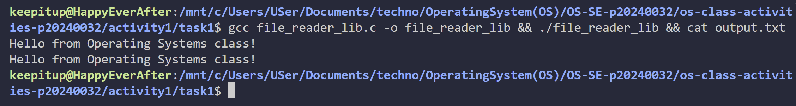

**Version B — POSIX System Calls (`file_reader_sys.c`):**

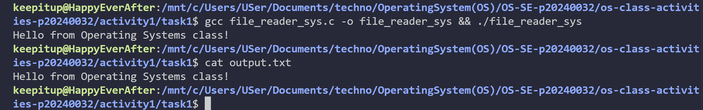

**Questions:**

1. **What does `read()` return? How is this different from `fgets()`?**

   > Read gives you how many bytes it read or 0 for EOF it just gives you bytes not a string fgets reads a line and gives you a C string stops at newline or buffer size

2. **Why do you need a loop when using `read()`? When does it stop?**

   > You need a loop cause read might not get the whole file in one go it stops when read returns 0 (end of file)

---

## Task 2: Directory Listing & File Info

**Describe your implementation:**  
I listed files in the current dir with both the library opendir readdir closedir and syscalls and used stat to get info

### Version A — Library Functions (`dir_list_lib.c`)

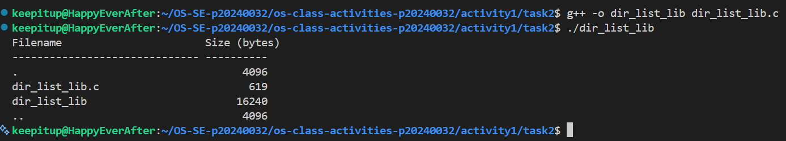

### Version B — System Calls (`dir_list_sys.c`)

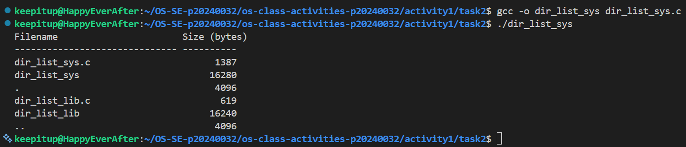

### Questions

1. **What struct does `readdir()` return? What fields does it contain?**

   > readdir gives you a pointer to struct dirent it has d_name (filename) d_ino (inode) d_type (file type) and some others

2. **What information does `stat()` provide beyond file size?**

   > stat gives you size permissions owner group timestamps inode file type

3. **Why can't you `write()` a number directly — why do you need `snprintf()` first?**

   > write just spits out bytes so to print a number you have  turn it into a string with snprintf first

---

## Optional Bonus: Windows API (`file_creator_win.c`)

Screenshot of running on Windows:

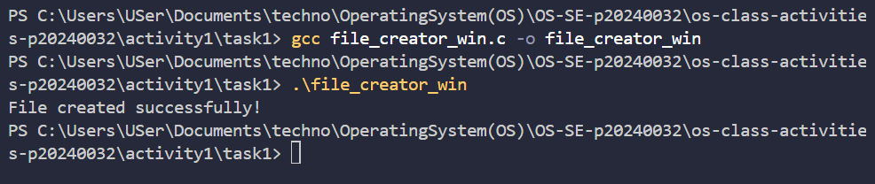

### Bonus Questions

1. **Why does Windows use `HANDLE` instead of integer file descriptors?**

   > HANDLE is just how Windows keeps track of resources it's like a pointer to an object not just a number like a file descriptor in Linux

2. **What is the Windows equivalent of POSIX `fork()`? Why is it different?**

   > Windows doesn't really have fork the closest is CreateProcess but it doesn't copy the whole process like fork does it's more like starting a new program

3. **Can you use POSIX calls on Windows?**

   > not really unless you use something WSL otherwise you have to use the Windows API

---

## Task 3: strace Analysis

**Describe what you observed:**  
the library version made more syscalls than the syscall version mostly cause of extra stuff for buffering memory and file checks kinda surprised how much extra work the library does

### strace Output — Library Version (File Creator)

<!-- Screenshot: strace -e trace=openat,read,write,close ./file_creator_lib -->
<!-- IMPORTANT: Highlight/annotate the key system calls in your screenshot -->
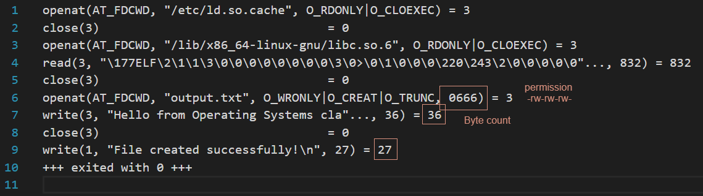

### strace Output — System Call Version (File Creator)

<!-- Screenshot: strace -e trace=openat,read,write,close ./file_creator_sys -->
<!-- IMPORTANT: Highlight/annotate the key system calls in your screenshot -->
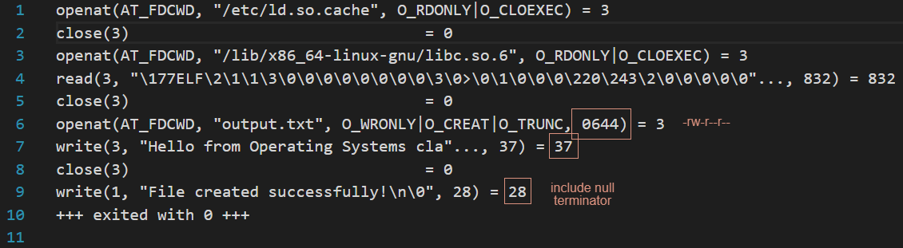

### strace Output — Library Version (File Reader or Dir Listing)

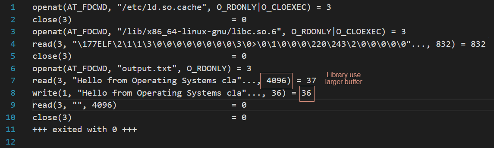

### strace Output — System Call Version (File Reader or Dir Listing)

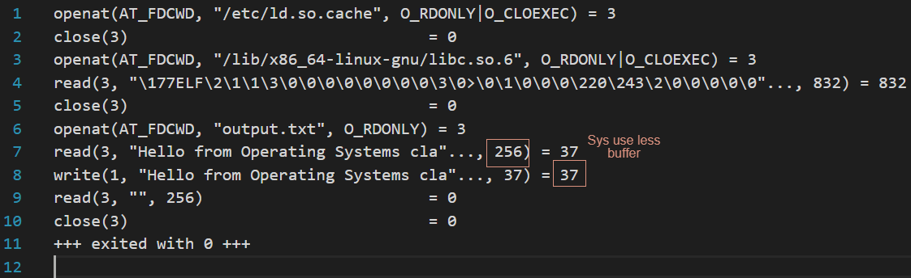

### strace -c Summary Comparison

<!-- Screenshot of `strace -c` output for both versions -->
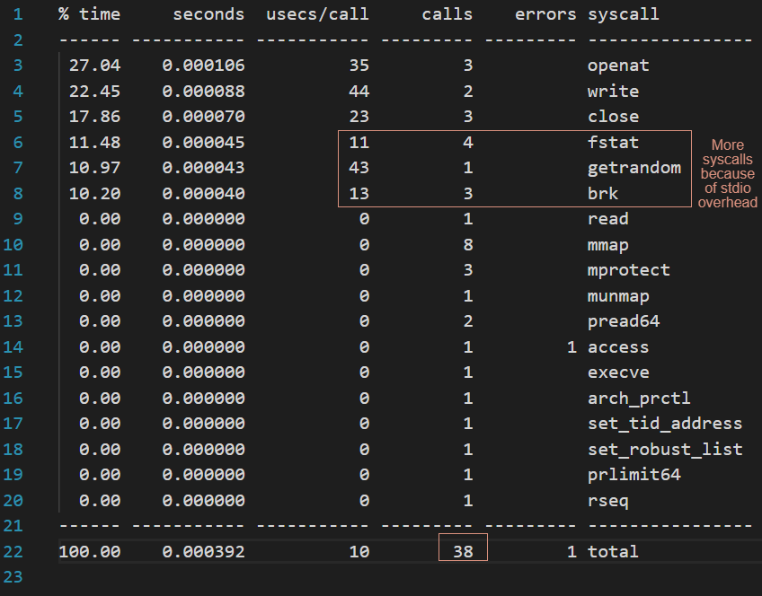
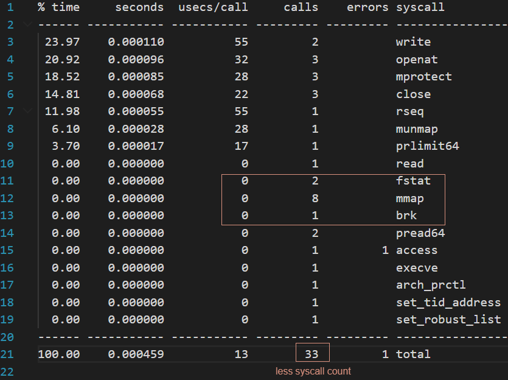

### Questions

1. **How many system calls does the library version make compared to the system call version?**

   > library version did 38 syscalls syscall version did 33 (from strace -c)

2. **What extra system calls appear in the library version? What do they do?**

   > extra ones like brk (memory) mmap (memory mapping) fstat (file status) getrandom (random for stdio)

3. **How many `write()` calls does `fprintf()` actually produce?**

   > in my test fprintf did one write call but could be more if buffer flushes

4. **In your own words, what is the real difference between a library function and a system call?**

   > library function is just code to help you use syscalls easier sometimes adds stuff like buffering syscall is a direct ask to the kernel for something

---

## Task 4: Exploring OS Structure

### System Information

> 📸 Screenshot of `uname -a`, `/proc/cpuinfo`, `/proc/meminfo`, `/proc/version`, `/proc/uptime`:

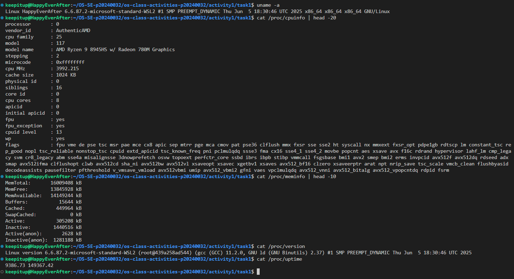

### Process Information

> 📸 Screenshot of `/proc/self/status`, `/proc/self/maps`, `ps aux`:

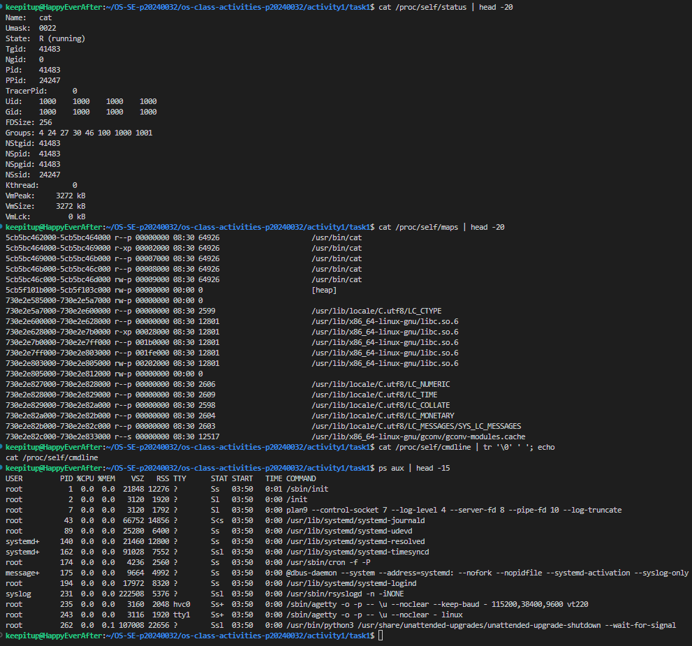

### Kernel Modules

> 📸 Screenshot of `lsmod` and `modinfo`:

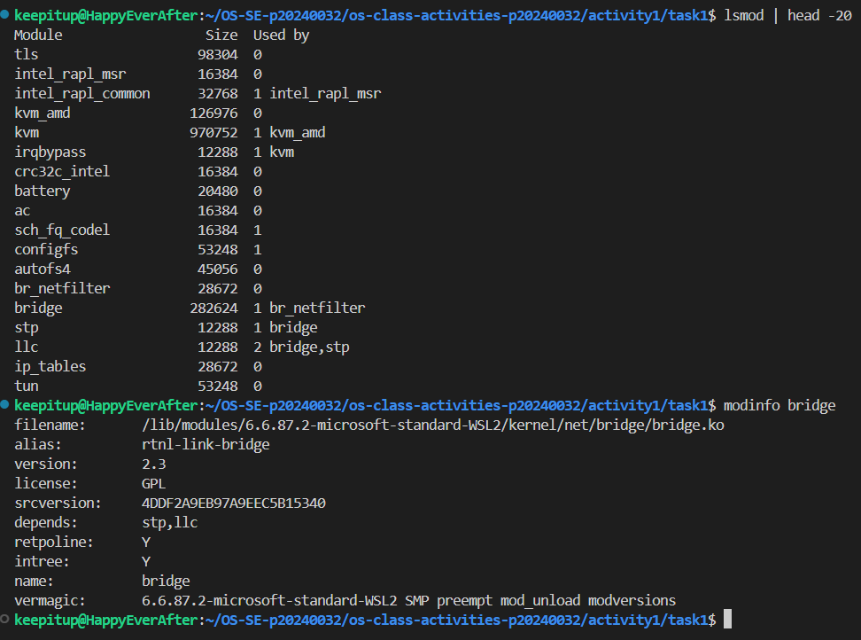

### OS Layers Diagram

> 📸 Your diagram of the OS layers, labeled with real data from your system:

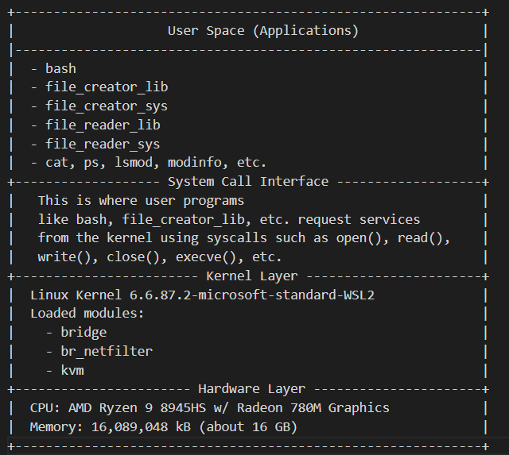

### Questions

1. **What is `/proc`? Is it a real filesystem on disk?**

   > /proc is a virtual filesystem it's not real files on disk it's just the kernel showing info about processes and the system

2. **Monolithic kernel vs. microkernel — which type does Linux use?**

   > linux is a monolithic kernel so it runs in kernel space not split up like a microkernel

3. **What memory regions do you see in `/proc/self/maps`?**

   > I see code segments data stack heap shared libs and more basically all the memory the process is using

4. **Break down the kernel version string from `uname -a`.**

   > it shows the kernel version build date architecture and some extra info like if it's SMP or PREEMPT

5. **How does `/proc` show that the OS is an intermediary between programs and hardware?**

   > /proc lets you see info about processes hardware and kernel settings all in one place so you can tell the OS is in the middle handling everything

---

## Reflection

What did you learn from this activity? What was the most surprising difference between library functions and system calls?

> What I learned is that library functions make things way easier but they hide a lot of what actually happens under the hood the most surprising thing was just how many extra syscalls and memory stuff the library does compared to calling syscalls directly makes you appreciate what the C library does for you but also why sometimes you want to use syscalls yourself