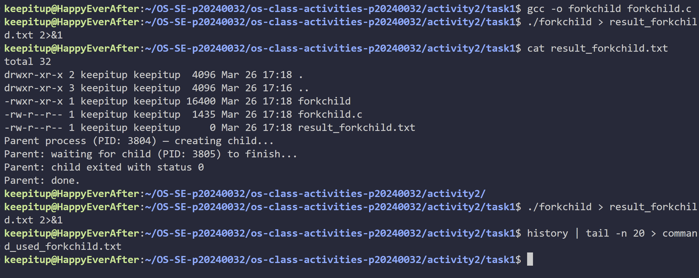
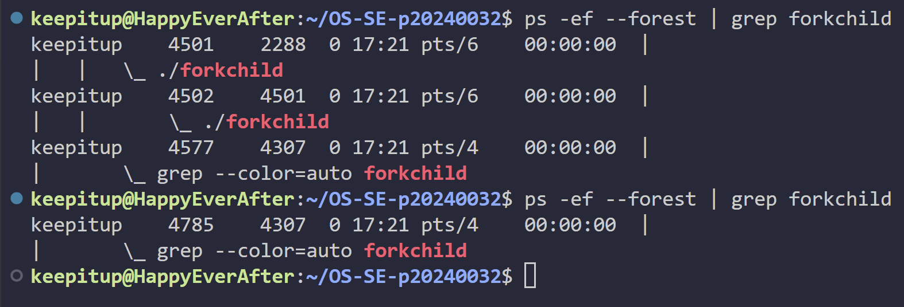
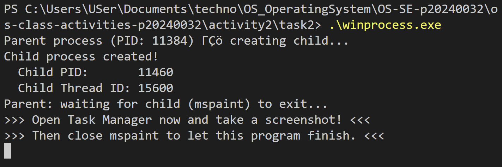
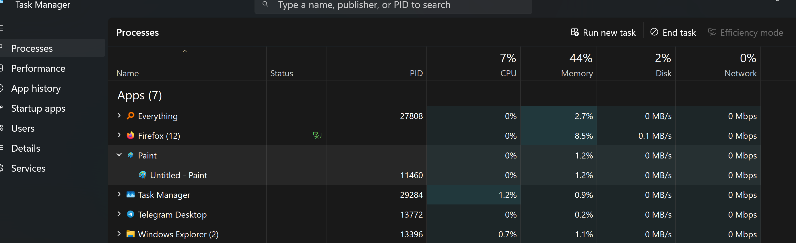
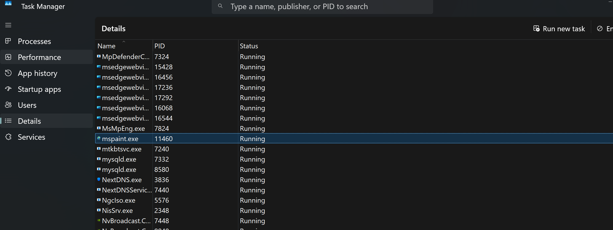
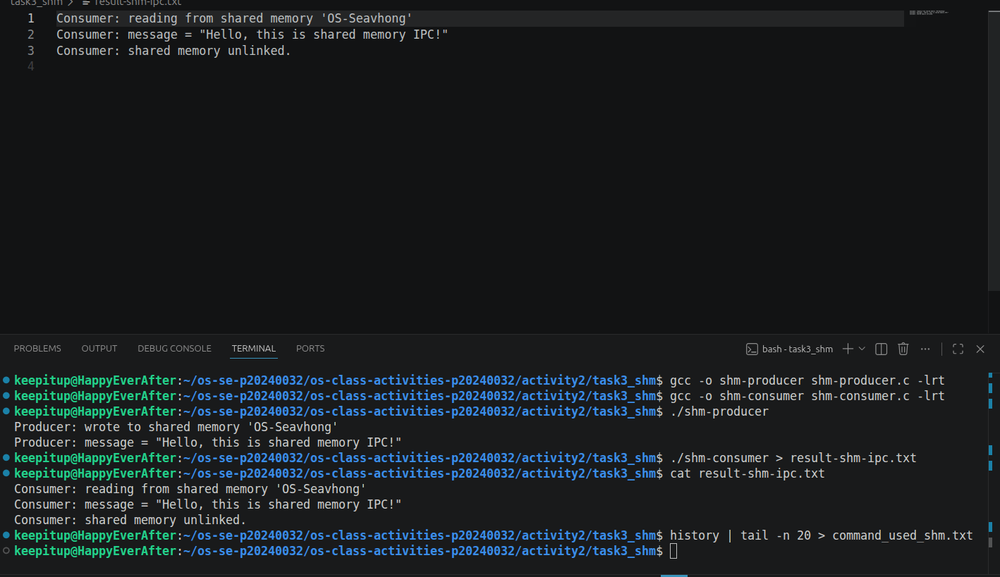
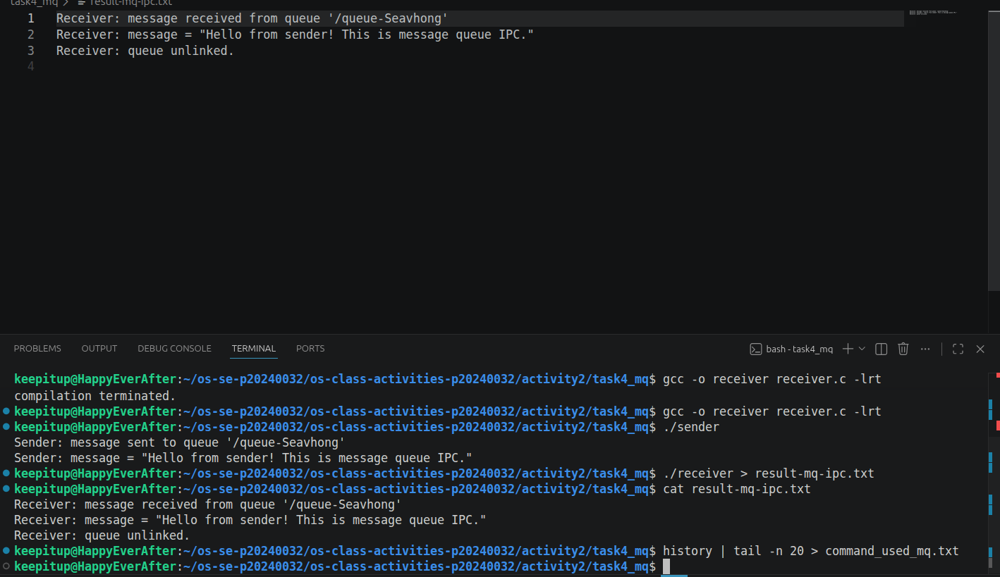

# Class Activity 2 — Processes & Inter-Process Communication

- **Student Name:** Chea Seavhong
- **Student ID:** p20240032
- **Date:** April 9, 2024

---

## Task 1: Process Creation on Linux (fork + exec)

### Compilation & Execution

Screenshot of compiling and running `forkchild.c`:



### Process Tree

Screenshot of the parent-child process tree (using `ps --forest`, `pstree`, or `htop` tree view):



### Output

```
total 32
drwxr-xr-x 2 keepitup keepitup  4096 Mar 26 17:18 .
drwxr-xr-x 3 keepitup keepitup  4096 Mar 26 17:16 ..
-rwxr-xr-x 1 keepitup keepitup 16400 Mar 26 17:18 forkchild
-rw-r--r-- 1 keepitup keepitup  1435 Mar 26 17:18 forkchild.c
-rw-r--r-- 1 keepitup keepitup     0 Mar 26 17:21 result_forkchild.txt
Parent process (PID: 4501) — creating child...
Parent: waiting for child (PID: 4502) to finish...
Parent: child exited with status 0
Parent: done.
```

### Questions

1. **What does `fork()` return to the parent? What does it return to the child?**

   > fork() returns the child's PID to the parent, and 0 to the child

2. **What happens if you remove the `waitpid()` call? Why might the output look different?**

   > Without waitpid(), the parent may finish before the child, causing output order to change or the child to become a zombie

3. **What does `execlp()` do? Why don't we see "execlp failed" when it succeeds?**

   > execlp() replaces the current process image with a new program. If it succeeds, code after it doesn't run, so "execlp failed" isn't printed

4. **Draw the process tree for your program (parent → child). Include PIDs from your output.**

   ``` 
    Parent (PID: 4501)
      └── Child (PID: 4502)
   ``` 
        

5. **Which command did you use to view the process tree (`ps --forest`, `pstree`, or `htop`)? What information does each column show?**

   > I used ps --forest. The columns show USER, PID, PPID, C, STIME, TTY, TIME
   

---

## Task 2: Process Creation on Windows

### Compilation & Execution

Screenshot of compiling and running `winprocess.c`:



### Task Manager Screenshots

Screenshot showing process tree in the **Processes** tab (mspaint nested under your program):



Screenshot showing PID and Parent PID in the **Details** tab:



### Questions

1. **What is the key difference between how Linux creates a process (`fork` + `exec`) and how Windows does it (`CreateProcess`)?**

   > Linux's fork to duplicate the process, then exec to run a new program; Windows' CreateProcess to create a new process directly

2. **What does `WaitForSingleObject()` do? What is its Linux equivalent?**

   > This function waits for process to finish. It is similar to waitipd() in Linux

3. **Why do we need to call `CloseHandle()` at the end? What happens if we don't?**

   > CloseHandle() releases system resources so not calling it can cause resource leaks

4. **In Task Manager, what was the PID of your parent program and the PID of mspaint? Do they match your program's output?**

   > The PID of parent program is 11460 and the PID of mspaint is also 11460 and it match the program's output.

5. **Compare the Processes tab (tree view) and the Details tab (PID/PPID columns). Which view makes it easier to understand the parent-child relationship? Why?**

   > The tree view from the Processes tab help with showing the parent-child relationship, while the Details tab shows the exact value of the PID. I prefer the Processes tab because it is more intuitive to see the parent-child relationship. 

---

## Task 3: Shared Memory IPC

### Compilation & Execution

Screenshot of compiling and running `shm-producer` and `shm-consumer`:



### Output

```
Consumer: reading from shared memory 'OS-Seavhong'
Consumer: message = "Hello, this is shared memory IPC!"
Consumer: shared memory unlinked.
```

### Questions

1. **What does `shm_open()` do? How is it different from `open()`?**

   > shm_open() opens/creates a shared memory object; open() is for files and shm_open() is for memory, not files. 

2. **What does `mmap()` do? Why is shared memory faster than other IPC methods?**

   > mmap() maps memory into a process's address space. Shared memory is faster because it avoids kernel/user space copying. 
3. **Why must the shared memory name match between producer and consumer?**

   > The shared memory name must match so both processes access the same memory region

4. **What does `shm_unlink()` do? What would happen if the consumer didn't call it?**

   > shm_unlink() removes the shared memory object. If not called, the memory persists and may cause resource leaks.

5. **If the consumer runs before the producer, what happens? Try it and describe the error.**

   > If the consumer runs first, it gets an error (e.g., "No such file or directory") because the shared memory doesn't exist yet.
---

## Task 4: Message Queue IPC

### Compilation & Execution

Screenshot of compiling and running `sender` and `receiver`:



### Output

```
Receiver: message received from queue '/queue-Seavhong'
Receiver: message = "Hello from sender! This is message queue IPC."
Receiver: queue unlinked.
```

### Questions

1. **How is a message queue different from shared memory? When would you use one over the other?**

   > Message queues send discrete messages; shared memory shares data directly. I use queues for structured messages, shared memory for large data.

2. **Why does the queue name in `common.h` need to start with `/`?**

   > Starting with / to make valid POSIX message queue

3. **What does `mq_unlink()` do? What happens if neither the sender nor receiver calls it?**

   > mq_unlink() removes the queue. If not called, the queue remains and may block future creations.

4. **What happens if you run the receiver before the sender?**

   > If we run receiver first, it waits until a message is sent

5. **Can multiple senders send to the same queue? Can multiple receivers read from the same queue?**

   > Yes, multiple senders and receivers can use the same queue, but receivers compete for messages

---

## Reflection

What did you learn from this activity? What was the most interesting difference between Linux and Windows process creation? Which IPC method do you prefer and why?

> I learned a lot about how processes are created and how it work. I see that Linux uses fork and exec, while Windows just uses CreateProcess. I found that using shared memory IPC the most useful because it’s simple and fast for sending bigger data between programs.