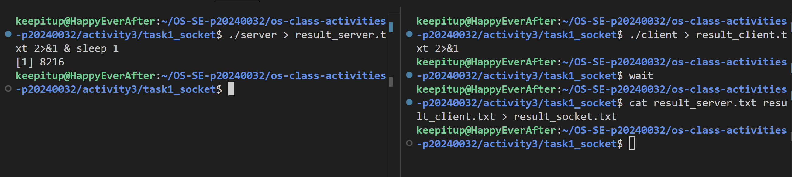
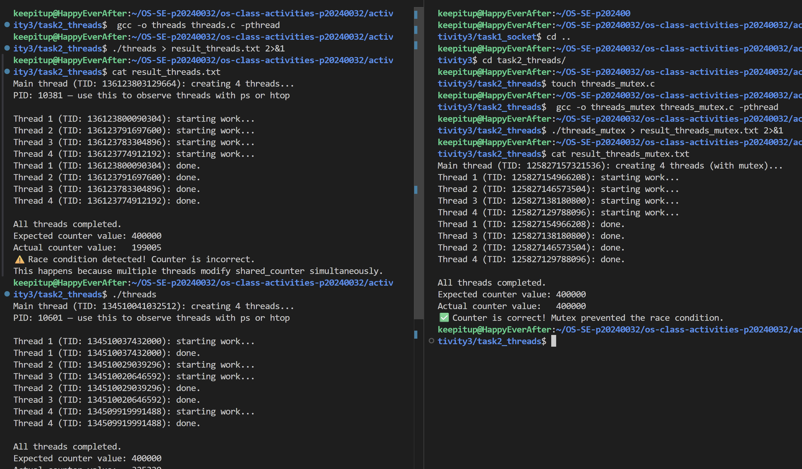
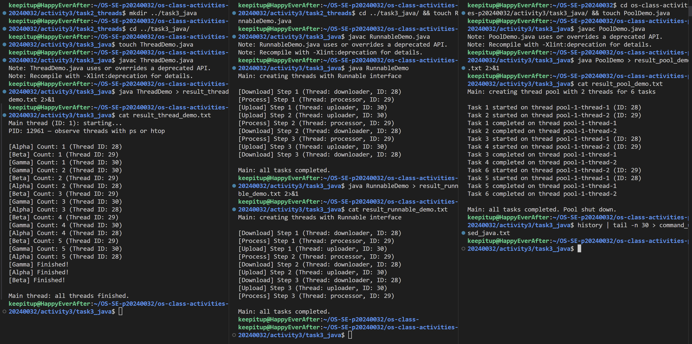
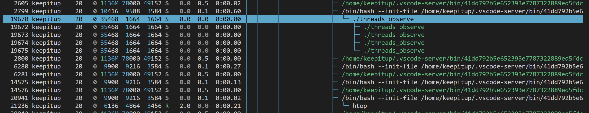
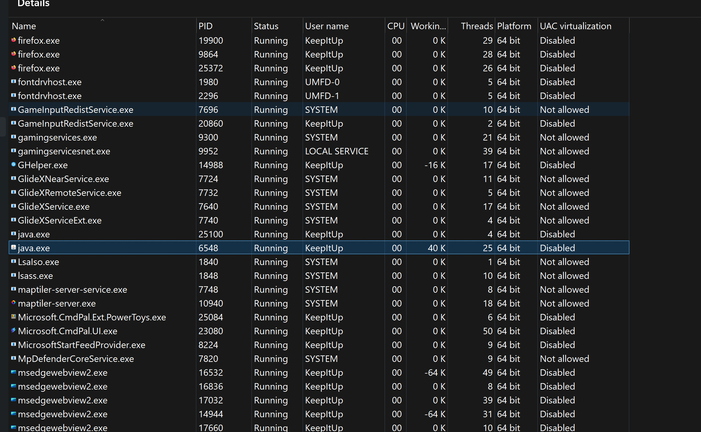

# Class Activity 3 — Socket Communication & Multithreading

- **Student Name:** Chea Seavhong
- **Student ID:** p20240032
- **Date:** April 10, 2026

---

## Task 1: TCP Socket Communication (C)

### Compilation & Execution



### Answers

1. **Role of `bind()` / Why client doesn't call it:**
   > bind() is for server to tell which port and IP to use. Client does not need bind because it just connect to server, not wait for connection.

2. **What `accept()` returns:**
   > accept() give new socket for talk with client. It is not the same as original server socket.

3. **Starting client before server:**
   > If client start first, it can't connect, then there will be error. Server must run before client.

4. **What `htons()` does:**
   > htons() change port number to network byte order, so different computer can understand same value.

5. **Socket call sequence diagram:**
   ```
   Server: socket() -> bind() -> listen() -> accept() -> read/write
   Client: socket() -> connect() -> read/write
   ```

---

## Task 2: POSIX Threads (C)

### Output — Without Mutex (Race Condition) && Output — With Mutex (Correct)



### Answers

1. **What is a race condition?**
   > Race condition is when two thread try to change same data at the same time, so result can be wrong or random.

2. **What does `pthread_mutex_lock()` do?**
   > pthread_mutex_lock() make only one thread to enter critical section, other thread must wait.

3. **Removing `pthread_join()`:**
   > If there is no pthread_join(), main thread could finish before other thread is done, so some work is not completed.

4. **Thread vs Process:**
   > Thread share memory, process does not. Thread is lighter, process is heavy and more isolated.

---

## Task 3: Java Multithreading

### ThreadDemo Output && RunnableDemo Output && PoolDemo Output



### Answers

1. **Thread vs Runnable:**
   > Thread is a class, Runnable is an interface. Runnable is better for reuse, Thread is easy for simple case.

2. **Pool size limiting concurrency:**
   > Pool size say how many thread can run at the same time. If there are more task, some must wait.

3. **thread.join() in Java:**
   > thread.join() makes main thread wait until that thread finish.

4. **ExecutorService advantages:**
   > ExecutorService manages thread pool easily, no need to create thread by hand, and it comes with more control and is safer.

---

## Task 4: Observing Threads

### Linux — `ps -eLf` Output

```
keepitup   19670    2799   19670  0    5 12:13 pts/4    00:00:00 ./threads_observe
keepitup   19670    2799   19672  0    5 12:13 pts/4    00:00:00 ./threads_observe
keepitup   19670    2799   19673  0    5 12:13 pts/4    00:00:00 ./threads_observe
keepitup   19670    2799   19674  0    5 12:13 pts/4    00:00:00 ./threads_observe
keepitup   19670    2799   19675  0    5 12:13 pts/4    00:00:00 ./threads_observe
keepitup   19888    6280   19888  0    1 12:14 pts/5    00:00:00 grep --color=auto threads_observe
```

### Linux — htop Thread View



### Windows — Task Manager



### Answers

1. **LWP column meaning:**
   > LWP mean Light Weight Process, it is like thread id in Linux. Each thread got own LWP number.

2. **/proc/PID/task/ count:**
   > It show how many thread is in a process, each folder is one thread.

3. **Extra Java threads:**
   > Java make extra thread for garbage collect, JIT, and other things, not just my code.

4. **Linux vs Windows thread viewing:**
   > Linux use ps, htop, Windows use Task Manager. Both can see thread but look different with different GUI.

---

## Reflection
> _What did you find most interesting about socket communication and threading? How does understanding threads at the OS level help you write better concurrent programs?_
``` 
Learning about socket communication and threading is new to me. It showed how programs can interact and run tasks at the same time, which is important for modern software. Understanding threads at the OS level helps me write safer and more efficient concurrent programs, and avoid problems like race conditions. 
```