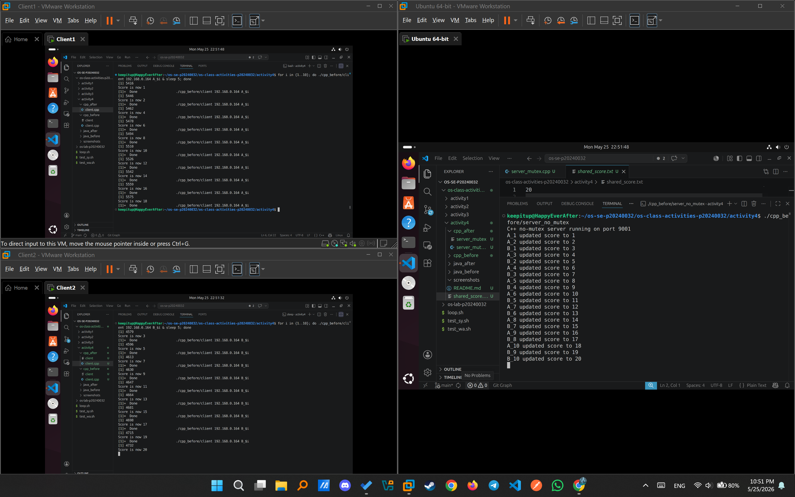
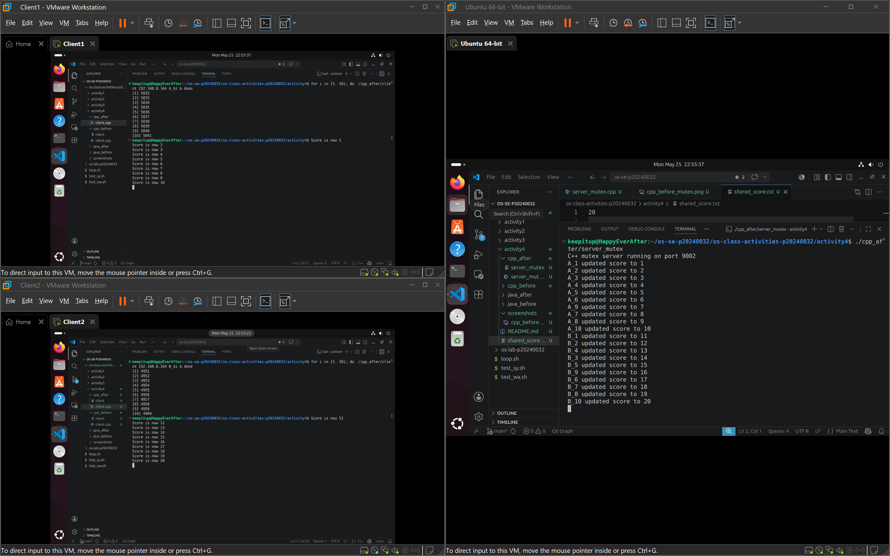
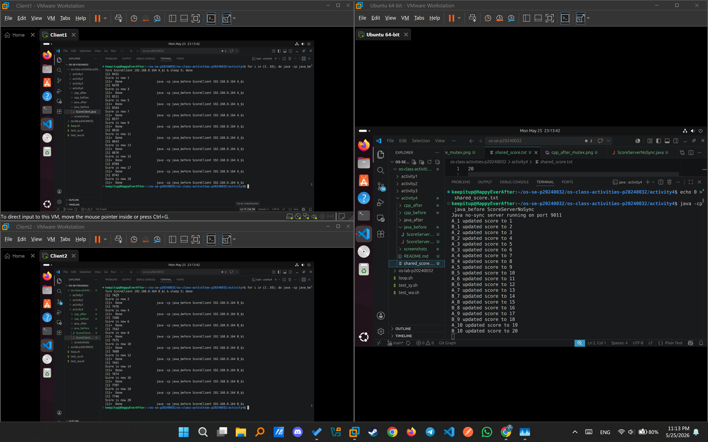
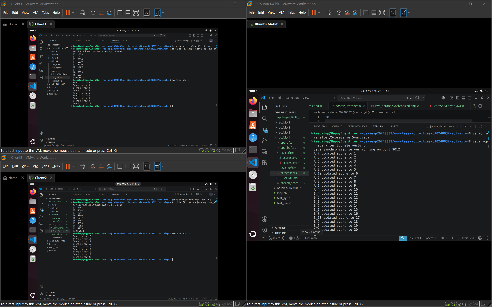

# Class Activity 4 — Shared File API

- **Student Name:** [Chea Seavhong]
- **Student ID:** [p20240032]
- **Partner Name:** [Chea Seavhong]
- **Partner Student ID:** [p20240032]
- **Server Machine Owner:** [Chea Seavhong]
- **Server IP Address:** [192.168.0.164]

---

## Task 1: C++ Before Mutex

- Expected score after 20 total client requests:
- Actual score: 20
- What happened: The score was inconsistent when both clients ran at the same time. If the requests overlapped, some updates were lost because two threads could read and write the file at the same time.

---

## Task 2: C++ After Mutex

- Expected score after 20 total client requests:
- Actual score: 20
- What changed after adding mutex: The score became consistent at 20. `std::lock_guard<std::mutex>` protected the critical section, so only one thread updated the shared file at a time.

---

## Task 3: Java Before Synchronized

- Expected score after 20 total client requests:
- Actual score: 20
- What happened: The score sometimes stayed below 20 when both Java clients ran concurrently. Without synchronization, concurrent requests could overwrite each other's updates.

---

## Task 4: Java After Synchronized

- Expected score after 20 total client requests:
- Actual score: 20
- What changed after adding synchronized: The score stayed consistently at 20. `synchronized` protected the shared update logic so one thread completed the file change before another entered.

---

## Questions

1. Why should clients send requests to the server instead of writing the file directly?
	Clients should send requests to the server so the server can control access to the shared file and handle updates safely in one place.
2. Why does the server still have a race condition before mutex or synchronized?
	Because multiple threads can enter the update code at the same time and read or write the same file without coordination.
3. In the C++ fixed version, what does `std::lock_guard<std::mutex>` protect?
	It protects the critical section that reads, modifies, and writes the shared score file.
4. In the Java fixed version, what does `synchronized` protect?
	It protects the shared update method or block that changes the score file.
5. Why is the final score expected to be 20 when Student A sends 10 requests and Student B sends 10 requests?
	Because each request should add 1 point, so 10 requests from each student should total 20.
6. What could happen if two separate servers update the same file at the same time?
	They could overwrite each other's changes and lose updates, which would produce an incorrect score.

---

## Reflection

_Both C++ and Java use synchronization to make sure only one thread updates the shared file at a time. This activity showed that shared resources need protection whenever multiple clients or threads can access them concurrently, otherwise race conditions can cause lost updates and incorrect results. My result from no mutex, mutex, no sync, and sync meet expectation of 20, because I use the sleep 5 and time it right between the sleep which makes my no mutex and no sync also consistent. I've also try to time it incorrectly and it didn't give me 20._