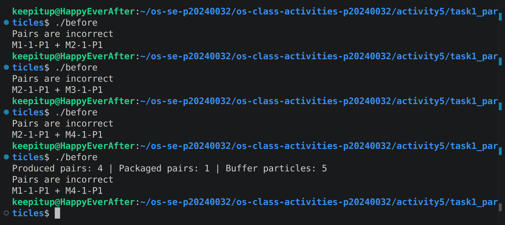
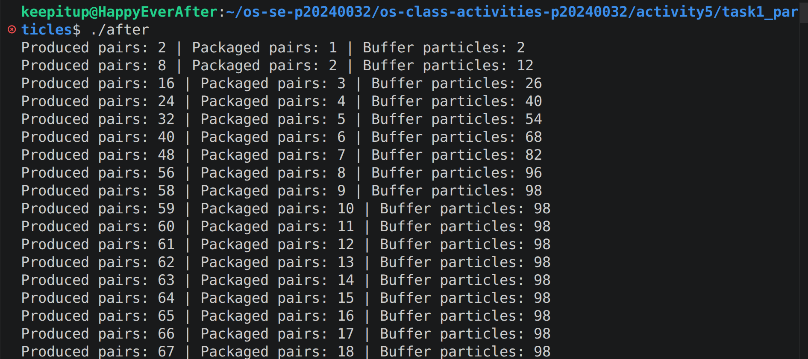
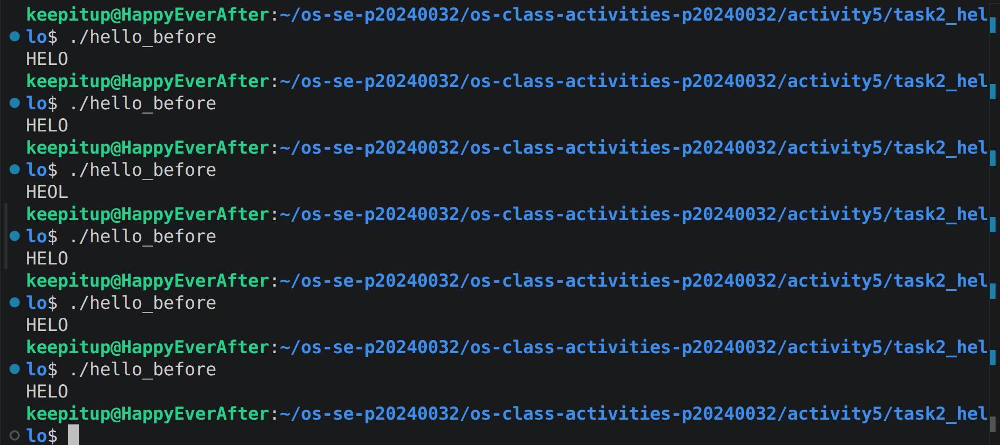
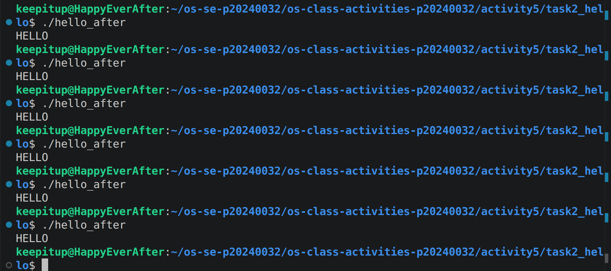

# Class Activity 5 - Semaphores

- **Student Name:** Chea Seavhong
- **Student ID:** p20240032
- **Programming Language Used:** C++

---

## Task 1A: Particle Pair Buffer Before Semaphores

- What error or incorrect behavior appeared:  
  The program showed race conditions such as broken producer or consumer states, incorrect pair verification, and occasional mismatched particle pairs. The buffer sometimes became inconsistent due to concurrent access.

- Why did this happen without semaphore protection:  
  Multiple producer and consumer threads accessed the shared buffer at the same time without synchronization. This caused race conditions where data was read or written inconsistently.

---

## Task 1B: Particle Pair Buffer After Semaphores

- Number of producer machines:  
  4

- Buffer capacity:  
  100

- Semaphores used:  
  - `emptyPairs` (tracks available buffer space)  
  - `fullPairs` (tracks available filled pairs)  
  - `bufferMutex` (protects critical section of buffer access)

- Produced pair count shown in screenshot: 67

- Packaged pair count shown in screenshot: 18

- Did any error appear during normal operation?  
  No. The system ran correctly with no race conditions or broken pair detection.

---

## Task 2A: HELLO Before Semaphores

- Output before semaphore ordering:  
  Example outputs may vary depending on scheduling, such as:
  - `HLEOL`
  - `LEHO`
  - `HELO`
  - `EOHL`
  
  but from the screenshots:
  - `HELO`
  - `HEOL`

- Why this output can be wrong or unpredictable:  
  Threads execute concurrently and the operating system scheduler determines execution order. Without synchronization, there is no guarantee that letters will be printed in sequence.

---

## Task 2B: HELLO After Semaphores

- Processes or threads used:  
  - Thread 1: prints `H` and `E`  
  - Thread 2: prints `L` and `L`  
  - Thread 3: prints `O`

- Semaphores used:  
  - `std::mutex`  
  - `std::condition_variable`  
  - Shared state variable `stage`

- Final output:  HELLO

---

## Questions

1. In Task 1, why does a producer need to wait before adding a pair to the buffer?  
A producer must wait when the buffer is full to avoid overwriting data and to ensure safe access to shared memory.

2. In Task 1, why does the consumer need to wait before removing a pair from the buffer?  
The consumer must wait until at least one full pair is available to avoid reading from an empty buffer.

3. Which semaphore protects the critical section in your particle buffer program?  
`bufferMutex` protects the critical section by ensuring only one thread accesses the buffer at a time.

4. How does your program verify that `P1` and `P2` belong to the same pair?  
It checks that both particles share the same prefix (`M<id>-<pairId>`), ensuring they were generated together.

5. In Task 2, why can the program print letters in the wrong order without semaphores?  
Because thread execution order is not controlled, the CPU scheduler may run threads in any order.

6. Which semaphore or synchronization step forces `H` to print before `E`, `L`, `L`, and `O`?  
The `stage` variable combined with `mutex` and `condition_variable` enforces sequential execution.

7. What could cause deadlock in either of your simulations?  
Deadlock can occur if a thread waits on a semaphore or condition that is never signaled, or if locks are not properly released.

---

## Reflection

These simulations demonstrated how semaphores and synchronization mechanisms are essential in multithreaded programming. In the particle buffer, semaphores prevented race conditions and ensured safe access to shared resources. In the HELLO task, synchronization guaranteed correct execution order. Overall, the activity showed that without proper synchronization, concurrent programs become unpredictable and unreliable.