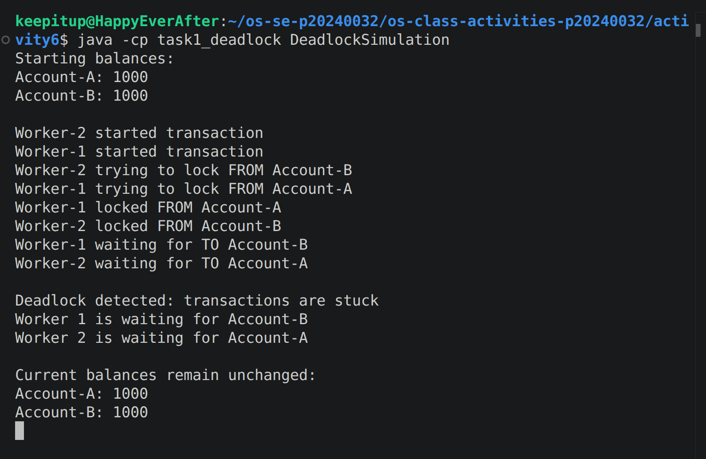
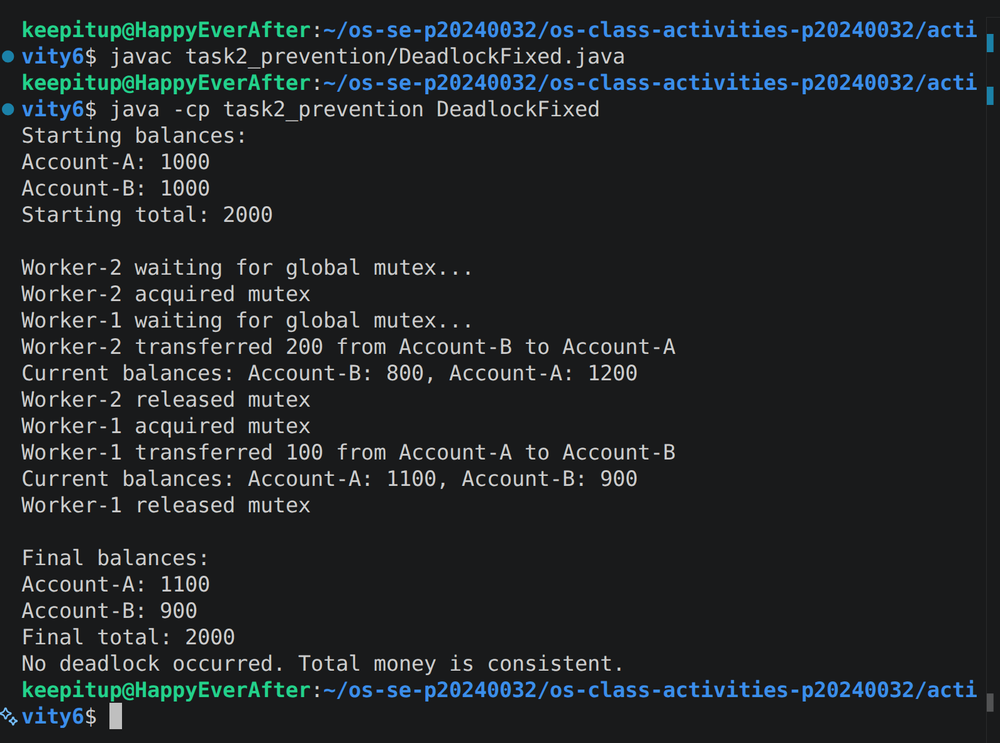

# Class Activity 6 - Deadlock Simulation

* **Student Name:** Chea Seavhong
* **Student ID:** p20240032
* **Programming Language Used:** Java

---

## Task 1: Deadlock Version

* Shared resources:

  * Account-A lock
  * Account-B lock

* Transaction 1:

  * Transfer 100 from Account-A to Account-B

* Transaction 2:

  * Transfer 200 from Account-B to Account-A

* Deadlock message shown:

  * Deadlock detected: transactions are stuck

* Explanation of why the program got stuck:

  * Worker 1 locked Account-A and then waited for Account-B.
  * Worker 2 locked Account-B and then waited for Account-A.
  * Each worker held one lock while waiting for the other lock.
  * Neither worker could continue or release its current lock.
  * This created a circular wait condition, resulting in a deadlock.

---

## Task 2: Deadlock Prevention Version

* Prevention strategy used:

  * A single shared semaphore mutex was used to protect the entire transfer operation.

* Semaphore mutex initial value:

  * 1

* Starting total:

  * 2000

* Final total:

  * 2000

* Did both transfers complete?

  * Yes. Both transfers completed successfully.

* Why no deadlock occurred:

  * Only one thread could enter the transfer critical section at a time.
  * The second thread had to wait for the mutex instead of acquiring account locks independently.
  * Because there was only one shared mutex, a circular wait could not occur.

---

## Questions

### 1. What are the two shared resources in your bank transaction simulation?

The two shared resources are the locks associated with Account-A and Account-B. Both transaction threads need access to these resources when performing transfers.

### 2. Which line or section of your Task 1 program creates hold-and-wait?

The hold-and-wait condition occurs after a thread acquires the lock on the source account and then attempts to acquire the lock on the destination account while still holding the first lock.

### 3. How does Task 1 create circular wait?

Worker 1 locks Account-A and waits for Account-B. At the same time, Worker 2 locks Account-B and waits for Account-A. Each thread is waiting for a resource held by the other thread, creating a circular dependency.

### 4. Why does the Task 1 program need a watchdog or timeout?

Without a watchdog, the program would simply hang forever when deadlock occurs. The watchdog detects that no transaction has completed after a specified time and prints a clear deadlock message for demonstration purposes.

### 5. How does the single semaphore mutex prevent deadlock in Task 2?

The mutex ensures that only one transfer thread can execute the critical section at a time. Since only one thread can access the accounts during a transfer, competing lock requests cannot create a circular wait.

### 6. Which of the four deadlock conditions does your Task 2 solution remove or avoid?

The solution removes the circular wait condition. Because only one thread can enter the critical section at a time, threads cannot hold resources while waiting for resources held by each other.

### 7. Why must the final total bank balance remain unchanged after both transfers?

Transfers only move money between accounts and do not create or destroy money. Therefore, the sum of all account balances should remain constant. The unchanged total verifies that the transfers were performed correctly.

---

## Reflection

This activity demonstrated how deadlocks can occur when multiple threads compete for shared resources without proper coordination. In real-world systems such as banking applications, databases, and file systems, deadlocks can cause transactions to stop responding and reduce system reliability. The activity showed that synchronization techniques such as mutexes, lock ordering, and timeout-based recovery can prevent or resolve deadlocks. Understanding these techniques is important for designing safe concurrent systems that remain responsive and maintain data integrity.
