# Class Activity 7 - Reasoning About Deadlock

- **Student Name:** Chea Seavhong
- **Student ID:** p20240032
- **My personalization:** a = 2, b = 3

---

## Task 1 — Resource Allocation Graphs

### Part A
**Graph 1 — my prediction:** 

[cycle? yes. deadlock? yes. the cycle path R0 -> P0 -> R1 -> P1 -> R2 -> P2 -> R0]

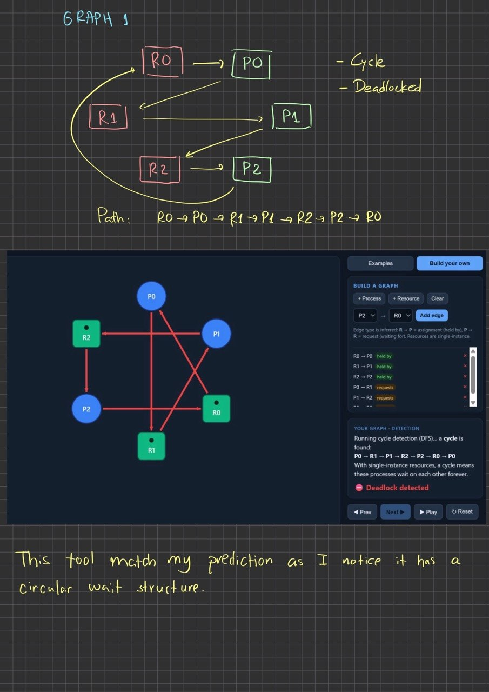
Matched the tool? [yes because i notice it has a circular structure and resource are single instance]

**Graph 2 — my prediction:** [no cycle and no deadlock]
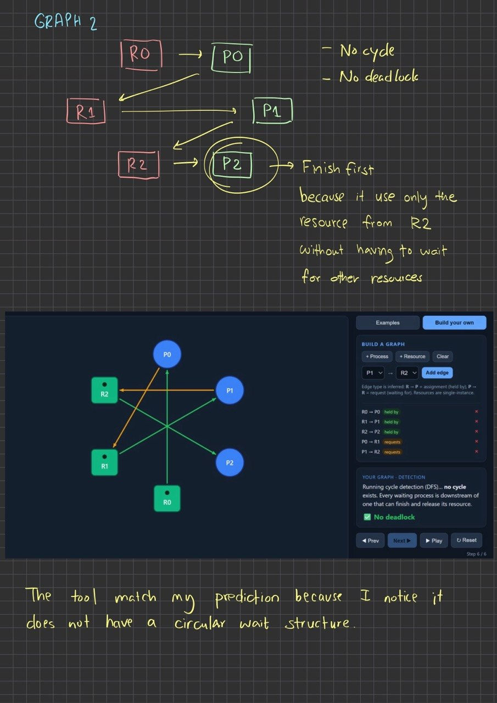
Matched the tool? [yes because I notice P2 got the necessary resource it need to finish and free its own resources which is essential for other processes to finish]

### Part B
**(i) Deadlocked 3×3 graph** 

edges I used:

P0 -> R2

R2 -> P2

P2 -> R1

R1 -> P1

P1 -> R0 

R0 -> P0

why it deadlocks: because it has a cycle and each resource has one instance that already given to a process, so when any other process request the resource doesn't have anymore to give making it stuck in a deadlock

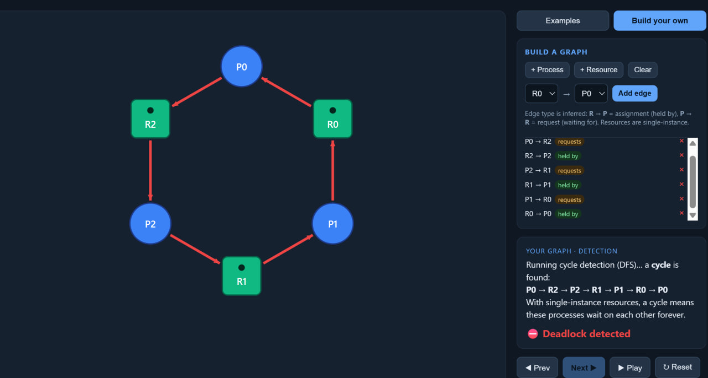

**(ii) No-cycle graph (≥4 nodes, ≥1 request)** 

why it is deadlock-free: because there is no cycle and R2 and R0 got an instance to give P1 and P3 respectively to finish its process and free it resource to give other process the chance to finish there process (P0 and P2) as well 

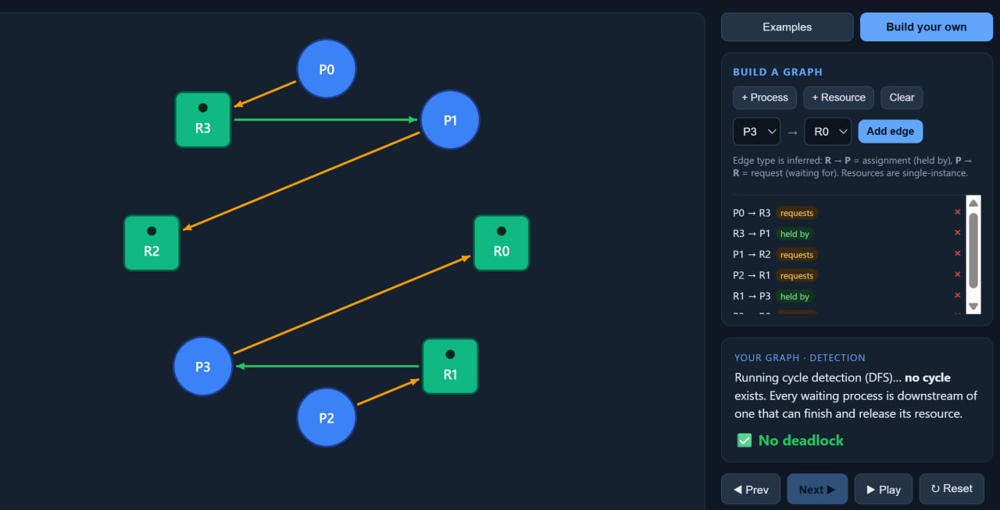

---

## Task 2 — Cycle ≠ Deadlock

**Warm-up (built-in examples)**
1. Why the "Cycle, NO deadlock" example is not deadlocked: because resourse (R2) has multiple instances that it can give to 2 process at the same time, one of which is P3 to finish it process and free up resource for the rest of the processes
2. The single change that causes deadlock: P3 requesting resource from R1 cause a deadlock because R1 instance is already held by P2 and it is a single instance so it doesn't have anymore resource to give P3

**Part A — given scenario**
- Available = Total − ΣAlloc = (1, 2) - (1, 2) = (0, 0)
- The cycle (as a path): R2 -> P1 -> R1 -> P2 -> R2  
Process in the cycle that can still finish because R2 has a spare instance to give to P3 for it to finish it process

| Step | Process |     Why Need ≤ Work    | Work after release |
|------|---------|------------------------|--------------------|
| 1    |   P3    | (0, 0) <= (0 , 0)      |      (0 , 1)       |
| 2    |   P2    | (0, 1) <= (0 , 1)      |      (1 , 1)       |
| 3    |   P1    | (1, 0) <= (1 , 1)      |      (1 , 2)       |

Conclusion: [NOT deadlocked — finishing order = P3 -> P2 -> P1]
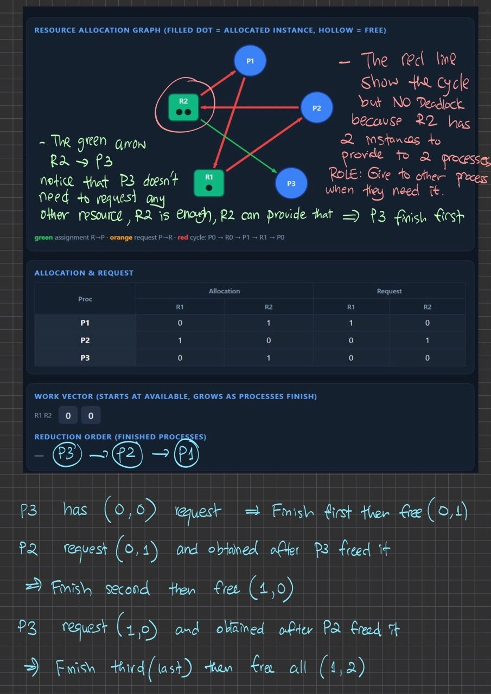
After changing P3's request to `1 0` — i predict it would stuck in a deadlock because (reduction terms Request <= Work) P3 is requesting (1, 0) which is greater than Work (0, 0), so that is not possible 
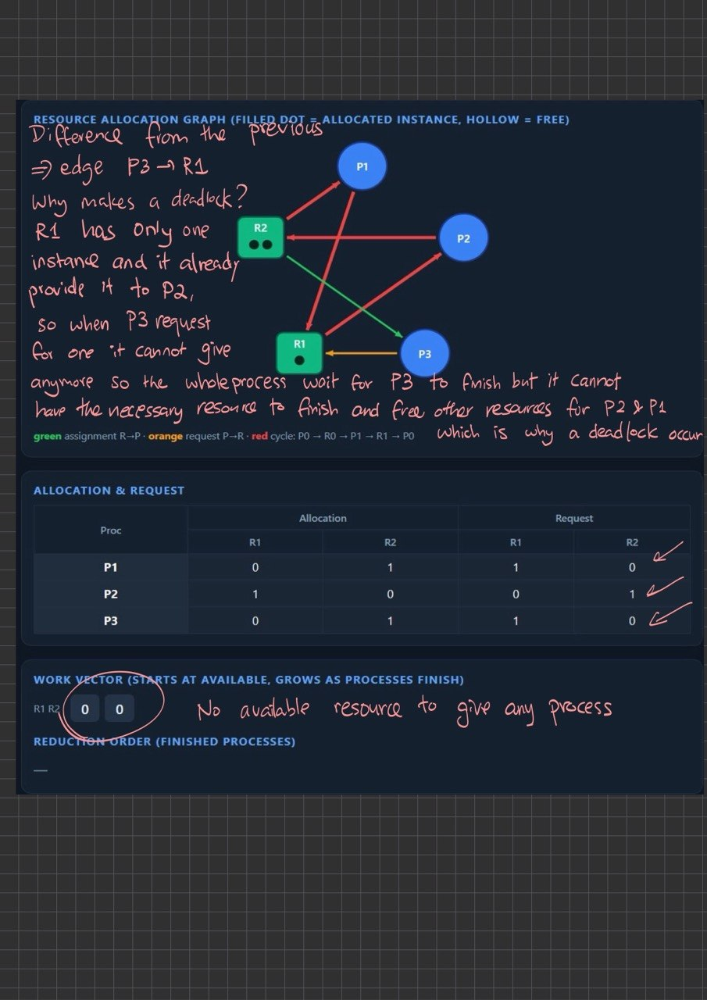

**Part B — my own scenario**
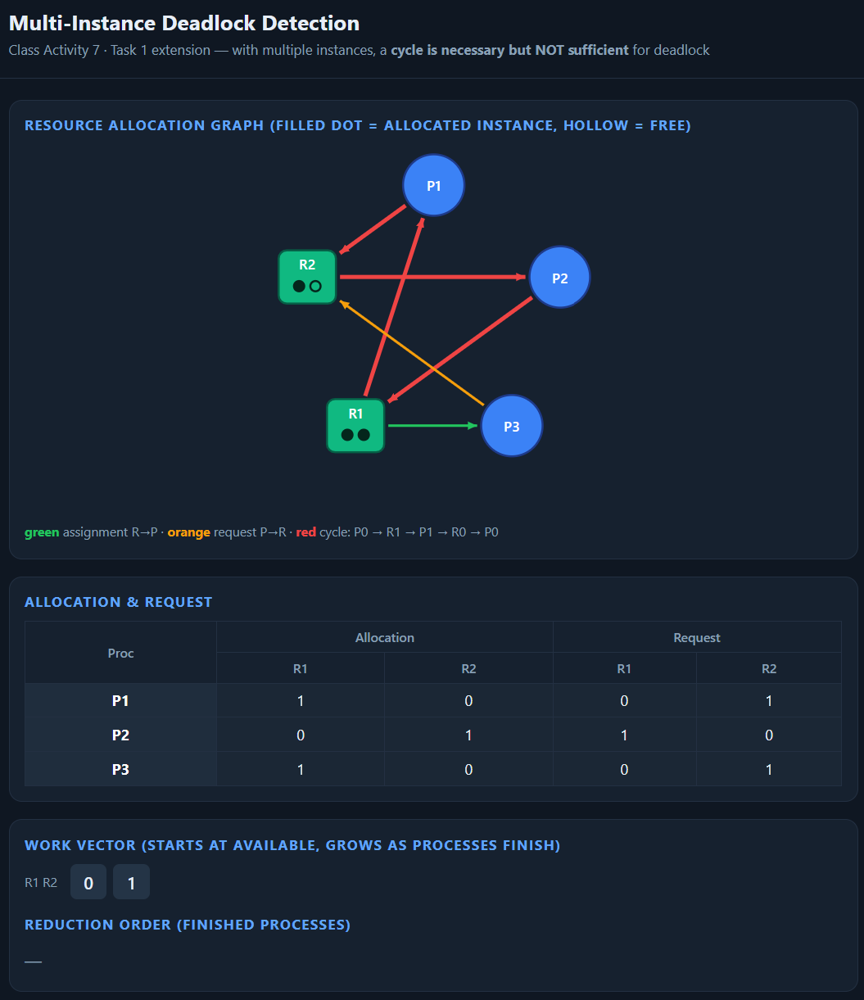
I allocate one instance R2 to P3 causing (reduction terms) the Work to be (0, 0) while P3 is still requesting for another (0, 1) but (0, 1) is not greater or equal to (0, 0) so it will stuck in a deadlock
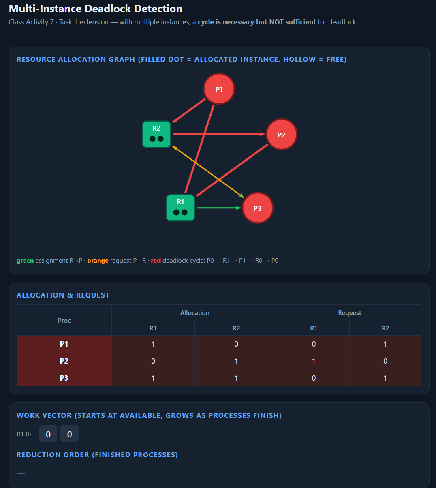

---

## Task 3 — Banker's Algorithm (my personalized scenario)

- Max[P0][A] = 7 + (2 mod 3) = 9   

- Max[P2][C] = 2 + (3 mod 4) = 5

- **Need matrix:** 
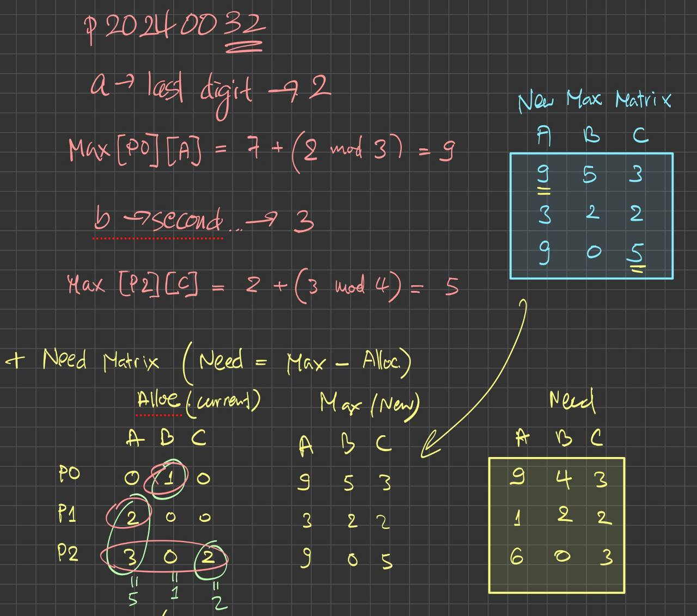

- **Available:** Total − ΣAlloc = (5, 4, 5)
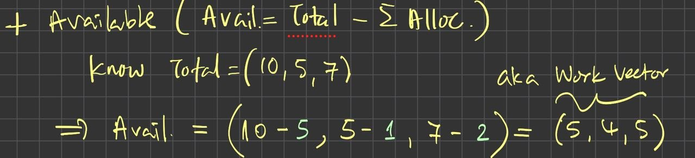

**Safety trace (by hand):** 
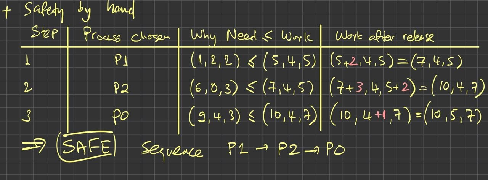

| Step | Process |     Why Need ≤ Work    | Work after release |
|------|---------|------------------------|--------------------|
| 1    |   P1    | (1, 2, 2) <= (5, 4, 5) |      (7, 4, 5)     |
| 2    |   P2    | (6, 0, 3) <= (7, 4, 5) |      (10, 4, 7)     |
| 3    |   P0    | (9, 4, 3) <= (10, 4 7) |      (10, 5, 7)     |

Conclusion: [SAFE — safe sequence = P1 -> P2 -> P0]
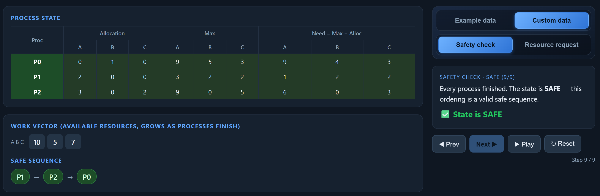
Matched the tool? yes

**Request I predicted GRANTED:** 

Request P2(3, 0, 1)

checks: 

1. (3, 0, 1) <= (6, 0, 3) ---> TRUE

2. (3, 0, 1) <= (5, 4, 5) ---> TRUE

3. SAFE

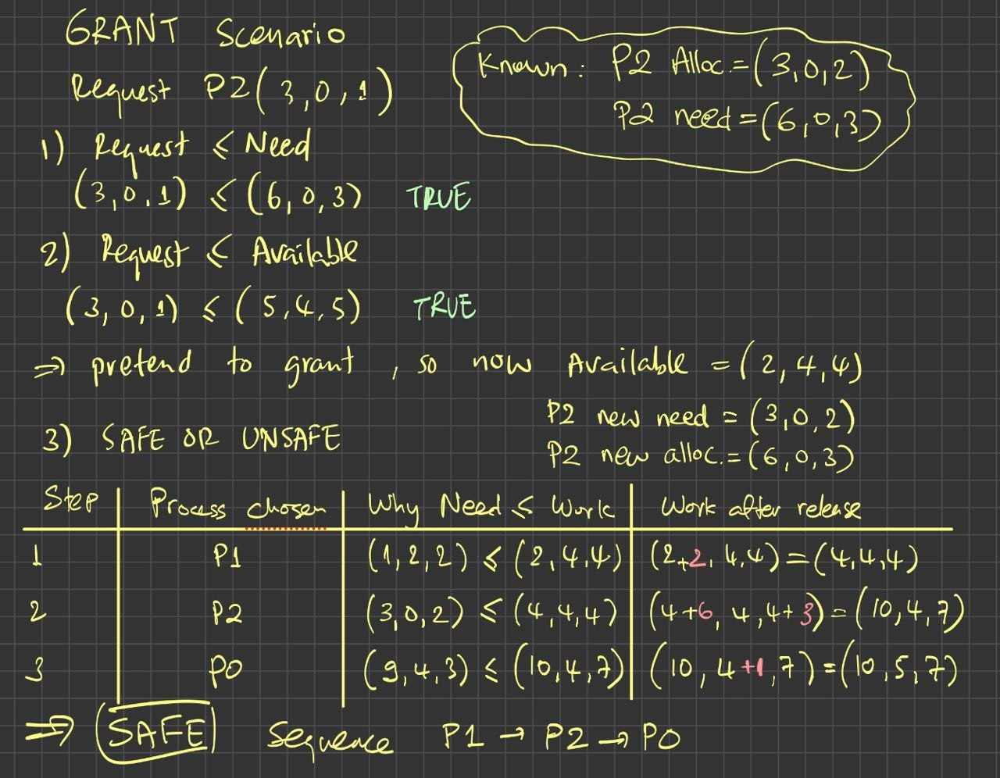
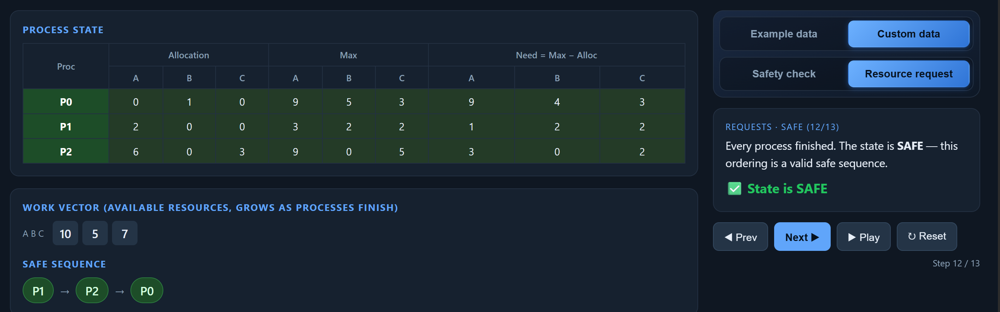

**Request I predicted DENIED:** 

I tried 2 cases: 

Case #1 
Request P1(2, 0, 0)

checks: 

1. (2, 0, 0) <= (1, 2, 2) ---> FALSE

Case #2 
Request P0(6, 0, 0)

checks: 

1. (6, 0, 0) <= (9, 4, 3) ---> TRUE

2. (6, 0, 0) <= (5, 4, 5) ---> FALSE

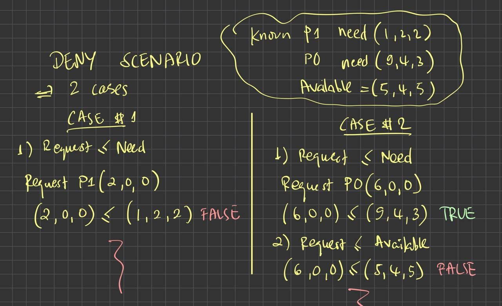
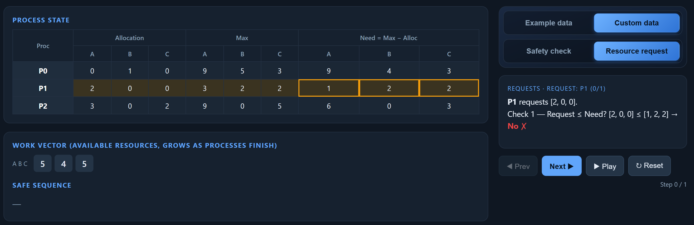
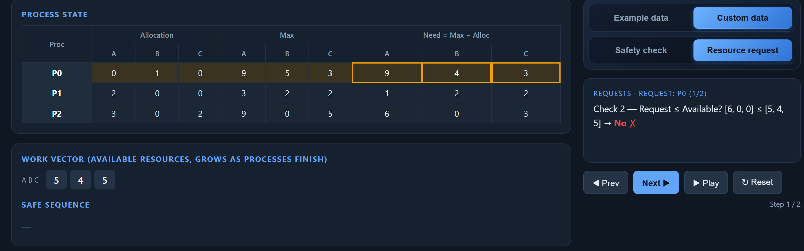

---

## Task 4 — Semaphores and Deadlock

**Case 1 (s1=s2=s3=1) — my answer:** [YES / NO] — interleaving + wait-for cycle, or why no cycle can form:
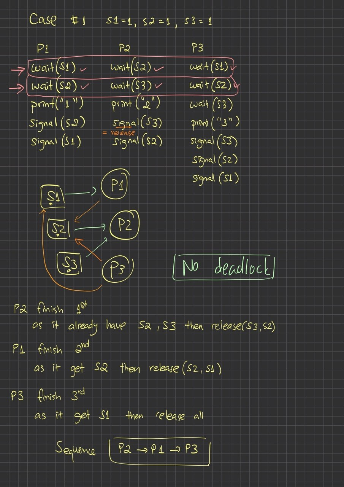
Tool confirmed? [...]

**Case 2 (s1=s2=s3=1) — my answer:** [YES / NO] — [...]
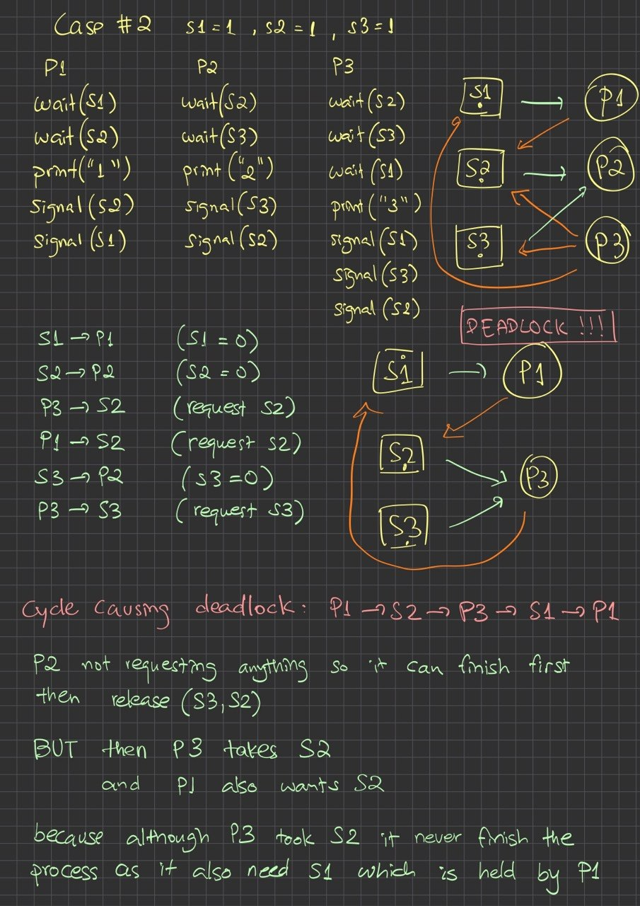
Tool confirmed? [...]

**Case 3 (s1=2) — my answer:** [YES / NO] — what the extra instance of s1 does:
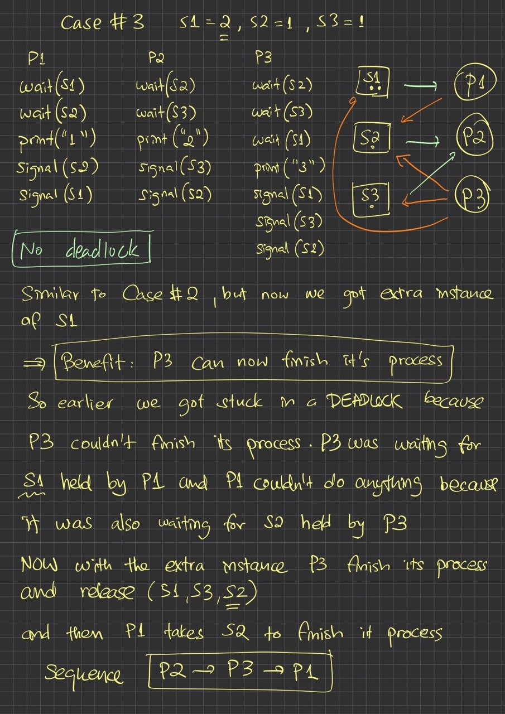
Tool confirmed? [...]

---

## Task 5 — Applied Concepts
1. [...]  2. [...]  3. [...]  4. [...]  5. [...]

---

## Reflection

_What did this activity teach you about why a cycle does not always mean deadlock, and about the trade-off between deadlock avoidance (Banker's) and detection + recovery in real systems such as databases or operating systems?_