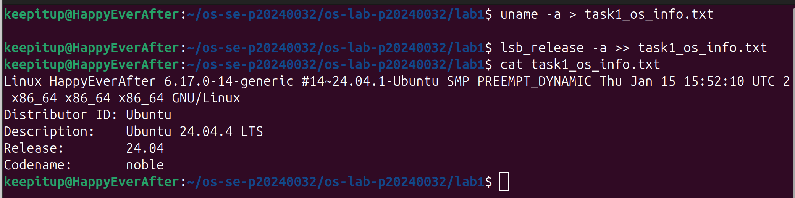
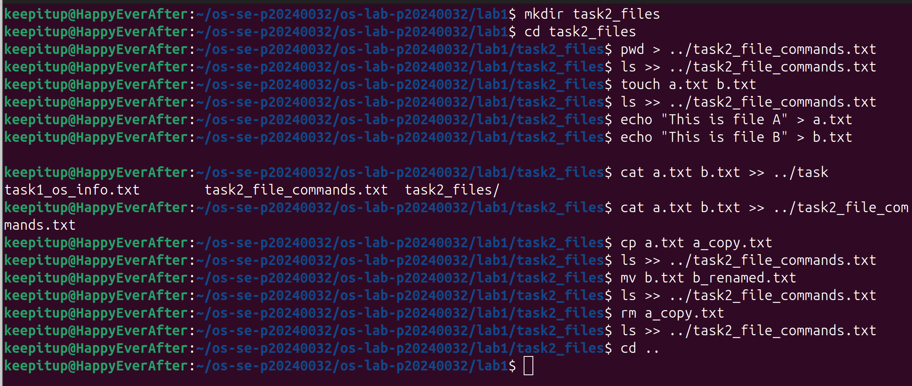
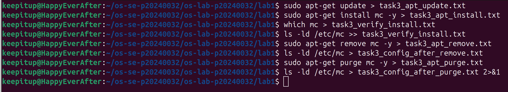
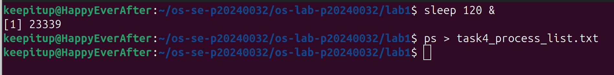
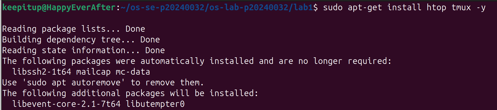
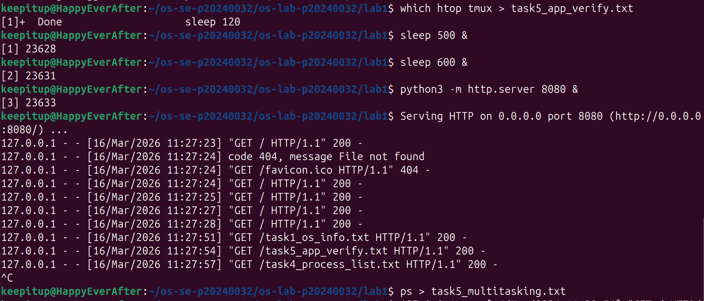
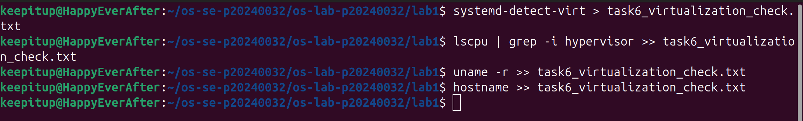

# OS Lab 1 Submission

- **Student Name:** CHEA Seavhong
- **Student ID:** p20240032

---

## Task 1: Operating System Identification

My computer is running Ubuntu 24.04 LTS with a Linux kernel. This tells me the type and version of my operating system.

## 

## Task 2: Essential Linux File and Directory Commands

I created, copied, renamed, and deleted files using basic Linux commands. I like the efficiency of using CLI as it taught me to manage files in the terminal, but honestly doing with GUI is much simpler just it takes longer with more button clicks.

## 

## Task 3: Package Management Using APT

`remove` deletes the program but keeps its settings. `purge` deletes both the program and its settings/config files, so that there is no trace of the program.

## 

## Task 4: Programs vs Processes (Single Process)

I ran a command `sleep 120 &` to start in the background, then used `ps` (process status) to see it listed as a running process.

## 

## Task 5: Installing Real Applications & Observing Multitasking

I installed apps and noticed that programs (sleep and python3) multitask.

## 

## 

## Task 6: Virtualization and Hypervisor Detection

My Ubuntu OS runs inside a virtual machine (VMware), not directly on physical hardware, which is my Windows.

## 
