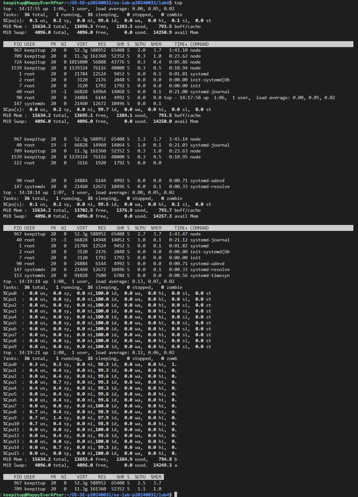
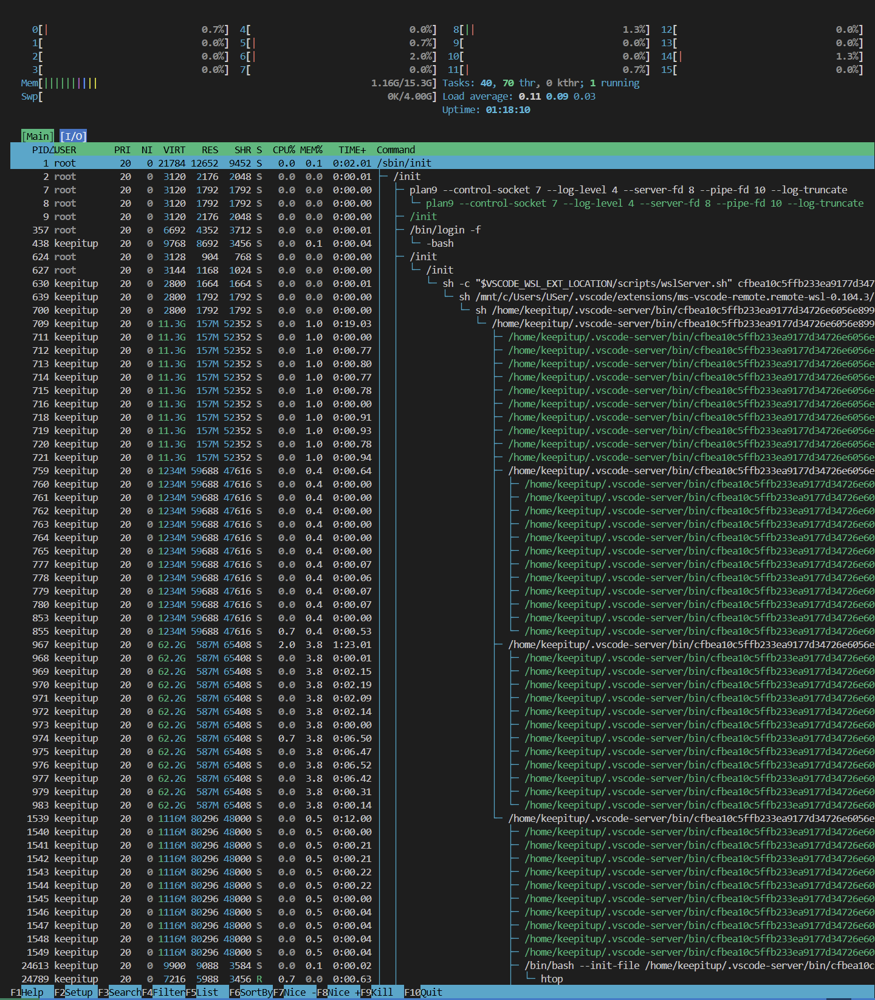
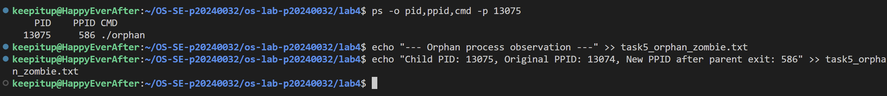
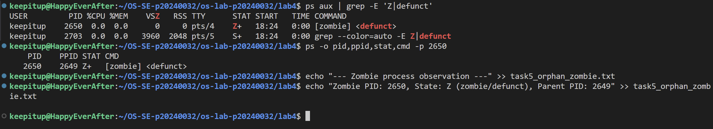
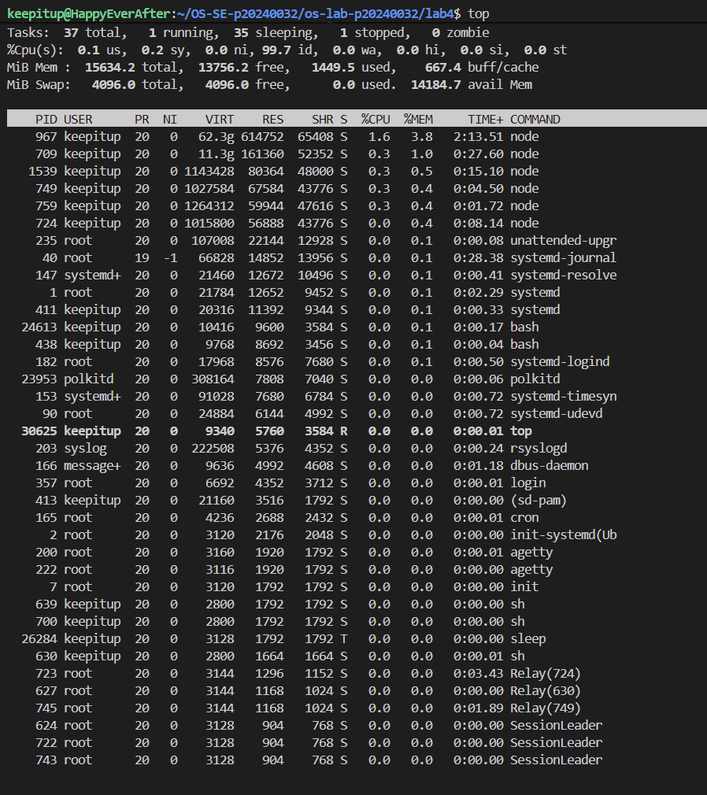
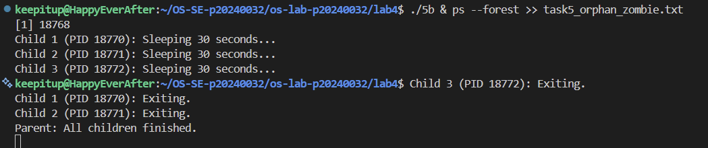
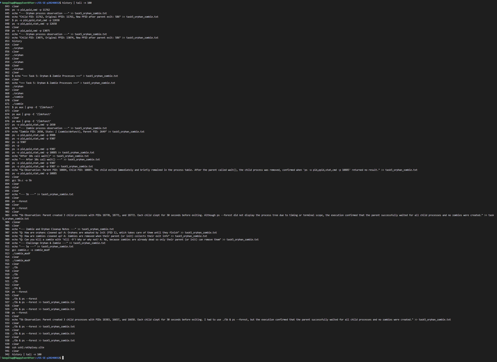

# OS Lab 4 Submission — I/O Redirection, Pipelines & Process Management

- **Student Name:** Chea Seavhong
- **Student ID:** p20240032

---

## Task Output Files

During the lab, each task redirected its output into `.txt` files. These files are your primary proof of work for the **guided portions** of each task. Make sure all of the following files are present in your `lab4/` folder:

- [X] `task1_redirection.txt`
- [X] `task2_pipelines.txt`
- [X] `task3_analysis.txt`
- [X] `task4_processes.txt`
- [X] `task5_orphan_zombie.txt`
- [X] `orphan.c`
- [X] `zombie.c`
- [X] `access.log`

---

## Screenshots

The screenshots below document the **interactive tools**, **process observations**, **challenge sections**, and **command history**.

---

### Screenshot 1 — Task 4: `top` Output

Show `top` running with the process list and column headers visible (PID, USER, %CPU, %MEM, COMMAND).

<!-- Insert your screenshot below: -->

---

### Screenshot 2 — Task 4: `htop` Tree View

Show `htop` in tree view (F5) displaying the process hierarchy with colored CPU/memory bars.

<!-- Insert your screenshot below: -->

---

### Screenshot 3 — Task 5: Orphan Process

Show the `ps` output proving the child process's PPID changed to 1 (or systemd PID) after the parent exited.

<!-- Insert your screenshot below: -->

---

### Screenshot 4 — Task 5: Zombie Process

Show the `ps` output with the zombie process visible — state `Z` or labeled `<defunct>`.

<!-- Insert your screenshot below: -->

---

### Screenshot 5 — Task 4 Challenge: Highest Memory Process

Show `top` sorted by memory usage with the top process identified.

<!-- Insert your screenshot below: -->

---

### Screenshot 6 — Task 5 Challenge: Process Tree with 3 Children

Show `ps --forest` output with the parent and 3 child processes visible.

<!-- Insert your screenshot below: -->

---

### Screenshot 7 — Command History

After finishing all tasks, run `history | tail -n 100` and take a screenshot.

<!-- Insert your screenshot below: -->

---

## Answers to Task 5 Questions

1. **How are orphans cleaned up?**
   > When a process becomes an orphan (its parent exits), the init process (PID 1) automatically adopts it. Init then waits for the orphaned process to finish and cleans up its resources, preventing it from becoming a zombie

2. **How are zombies cleaned up?**
   > Zombies are cleaned up when their parent process calls wait() or waitpid() to read their exit status. If the parent exits without doing so, init (PID 1) adopts the zombie and cleans it up.

3. **Can you kill a zombie with `kill -9`? Why or why not?**
   > No, you cannot kill a zombie with 'kill -9' because a zombie process is already dead; it has finished execution but is waiting for its parent to collect its exit status. The only way to remove a zombie is for its parent (or init) to reap it using wait() by parent or init will eventually reap it automatically.

---

## Reflection

> Useful command/technique I learned in this lab was using pipelines (|) and I/O redirection (>, >>, <) along with other commands connected together to control where input and output belong. In real server environment, I'll use piplines (|) combining with cat, grep, sort, uniq, etc to filter data. Then I can redirect to save data I collect into files for later use or without doing manually which save time and energy (i.e echo "Stay curious" > keepitup.txt).