# OS Lab 6 Submission — Linux Security, Users, Groups & File Permissions

* **Student Name:** Chea Seavhong
* **Student ID:** p20240032

---

## Task Output Files

Make sure all of the following files are present in your `lab6/` folder:

* [x] `task1_users.txt`
* [x] `task2_groups.txt`
* [x] `task3_permissions.txt`
* [x] `task3_stat_output.txt`
* [x] `task4_special_bits.txt`
* [x] `task5_acl.txt`
* [x] `security_lab/whoami_suid.c`

---

## Screenshots

### Screenshot 1 — Task 1: User Creation

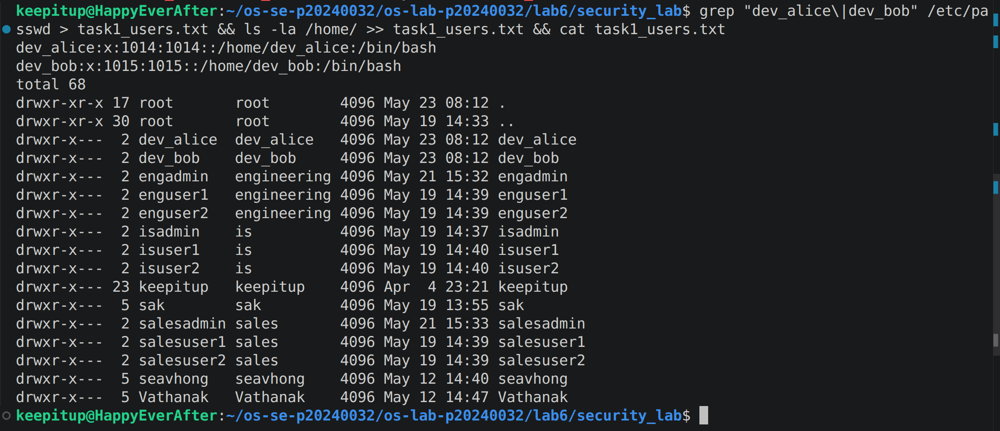

### Screenshot 2 — Task 1: User Modification

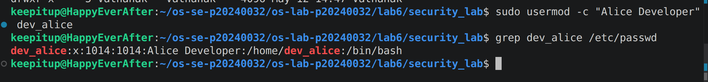

### Screenshot 3 — Task 2: Group Setup

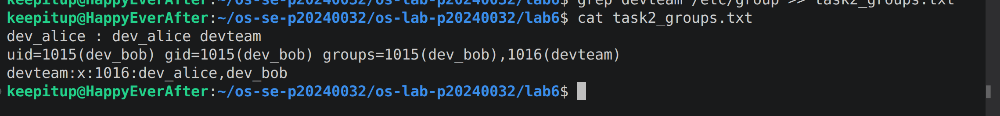

### Screenshot 4 — Task 2: Multiple Group Membership

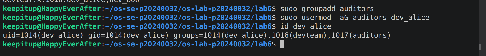

### Screenshot 5 — Task 3: Directory Permissions

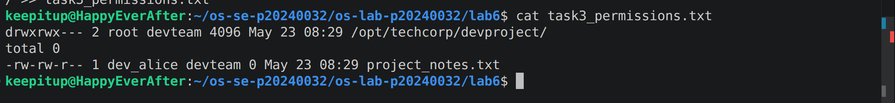

### Screenshot 6 — Task 3: Access Denied

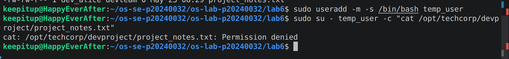

### Screenshot 7 — Task 4: setgid Bit

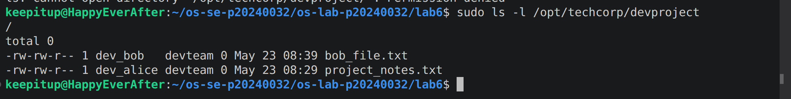

### Screenshot 8 — Task 4: Sticky Bit

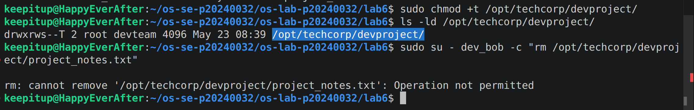

### Screenshot 9 — Task 4: setuid Bit

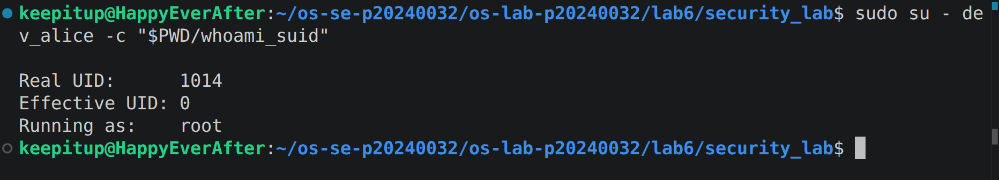

### Screenshot 10 — Task 5: ACL Directory

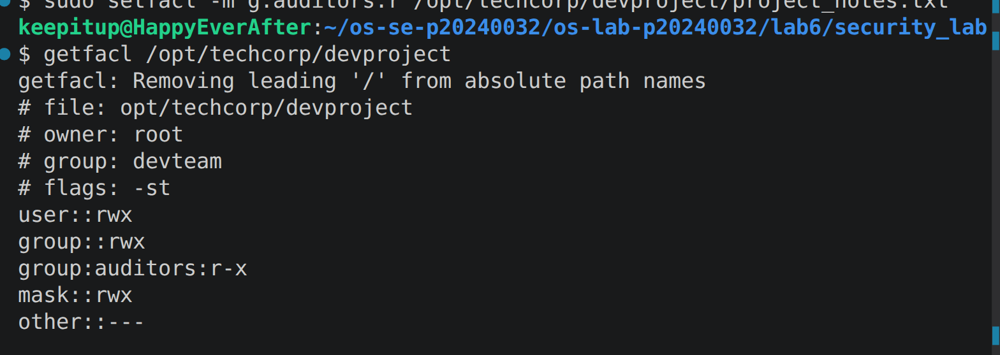

### Screenshot 11 — Task 5: ACL Access Test

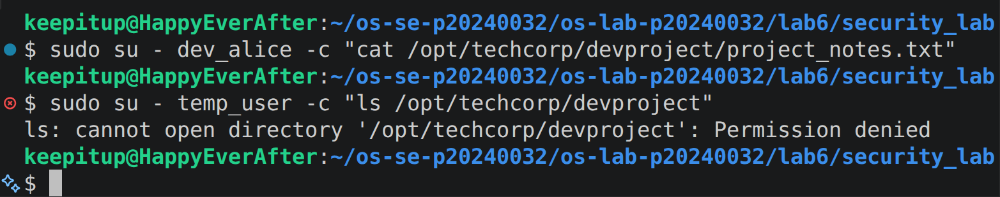

### Screenshot 12 — Task 5: ACL Output File

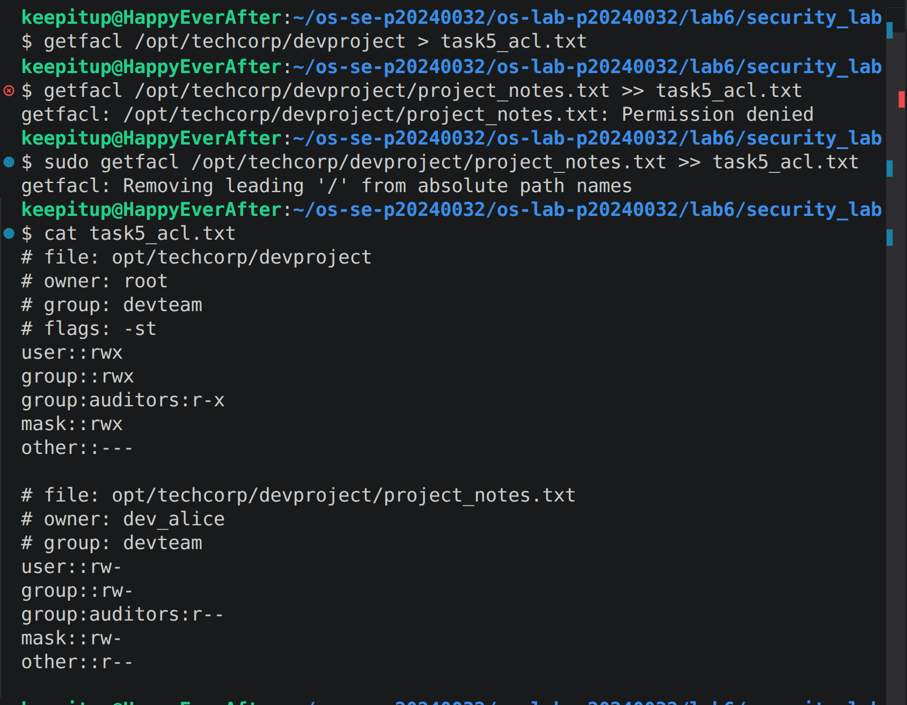

---

## Answers to Lab Questions

### 1. What is the difference between `userdel` and `userdel -r`?

`userdel` removes the user account from the system but leaves the user's home directory, mail spool, and personal files intact. In contrast, `userdel -r` removes the user account and also deletes the user's home directory and mail spool. This option is useful when completely removing a user and their associated data from the system.

### 2. Why is it safer to use `visudo` instead of directly editing `/etc/sudoers`?

`visudo` performs syntax checking before saving changes to the sudoers file. If a syntax error is detected, it warns the administrator and prevents the file from being saved incorrectly. This reduces the risk of locking administrators out of sudo access due to configuration mistakes. It also provides file locking to prevent multiple administrators from editing the file simultaneously.

### 3. What happens when a `setgid` directory contains files created by different users? What benefit does this provide for team collaboration?

When a directory has the `setgid` bit set, all new files and subdirectories created inside it automatically inherit the directory's group ownership instead of the creator's primary group. As a result, files created by different users will all belong to the same shared group. This simplifies collaboration because team members who belong to that group can access and manage shared project files without manually changing group ownership each time a new file is created.

### 4. What limitation of standard Unix permissions does the ACL system solve?

Standard Unix permissions allow permissions to be assigned only to one owner, one group, and all other users. ACLs (Access Control Lists) extend this model by allowing administrators to grant specific permissions to multiple individual users and groups without changing file ownership or group membership. This provides more flexible and fine-grained access control for shared resources.

---

## Conclusion

In this lab, Linux user and group management, file permissions, special permission bits (`setuid`, `setgid`, and sticky bit), and Access Control Lists (ACLs) were explored and configured. The exercises demonstrated how Linux security mechanisms can be used to control access to files and directories, support team collaboration, and enforce secure multi-user environments.
