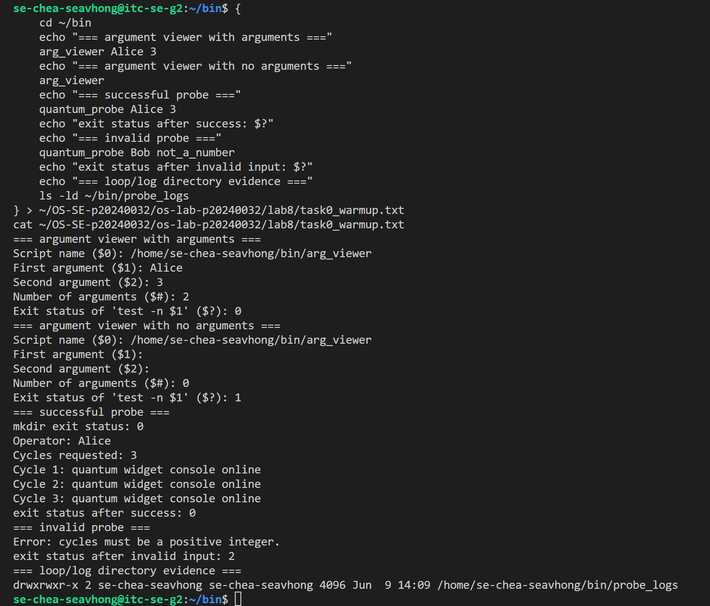
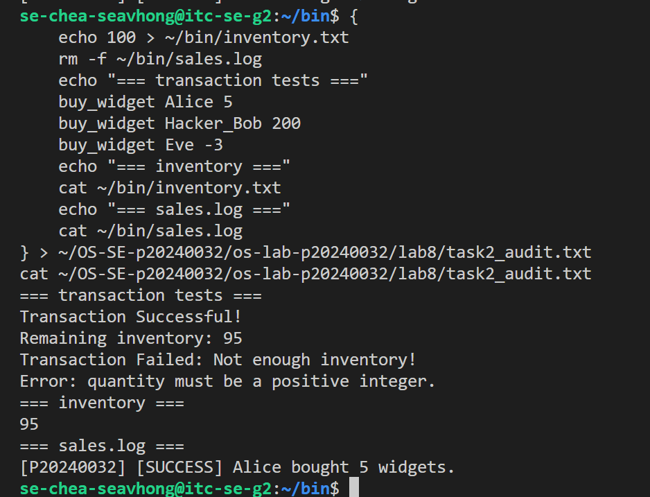
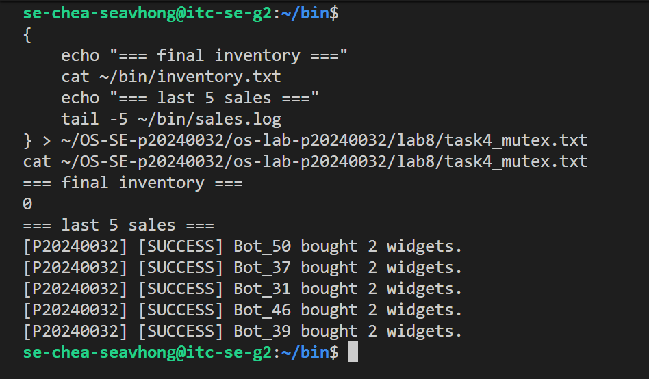
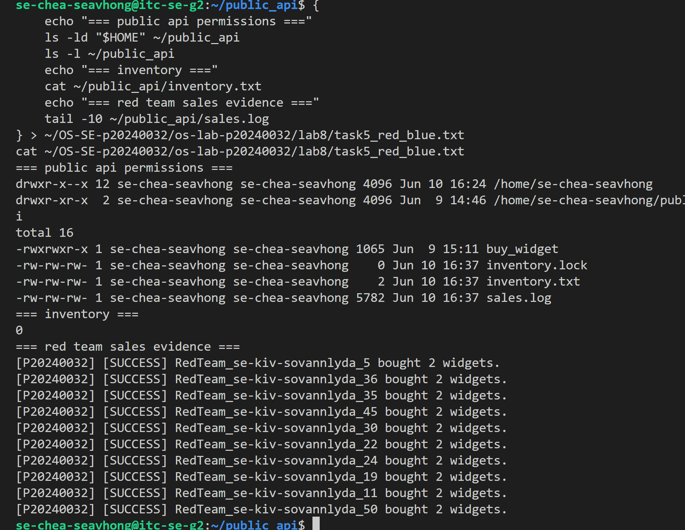
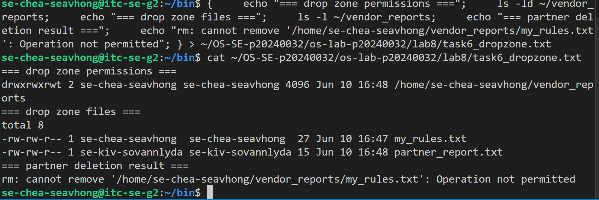
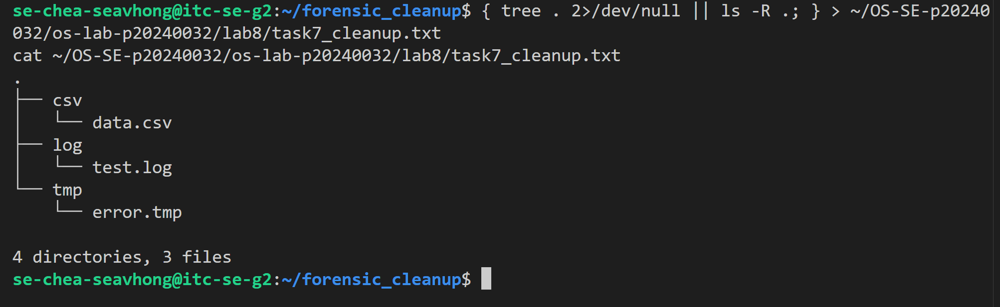

# OS Lab 8 Submission - The Quantum Widget Exploit

- **Student Name:** Chea Seavhong
- **Student ID:** p20240032
- **Partner Username:** se-kiv-sovannlyda

---

## Task Output Files

Make sure all of the following files are present in your `lab8/` folder:

- [ ] `observations.txt`
- [ ] `task0_warmup.txt`
- [ ] `task1_validation.txt`
- [ ] `task2_audit.txt`
- [ ] `task4_mutex.txt`
- [ ] `task5_red_blue.txt`
- [ ] `task6_dropzone.txt`
- [ ] `task7_cleanup.txt`
- [ ] `scripts/arg_viewer`
- [ ] `scripts/quantum_probe`
- [ ] `scripts/buy_widget`
- [ ] `scripts/bot_swarm`
- [ ] `scripts/create_dropzone`
- [ ] `scripts/cleanup`

---

## Screenshots

Insert your screenshots below.

### Screenshot 1 - Level 0: Bash Warm-Up Scripts
Show `arg_viewer` explaining `$0`, `$1`, `$2`, `$#`, and `$?`, then show `quantum_probe` using a condition and a loop.

---

### Screenshot 2 - Level 2: Audit Trails
Show input validation, a successful sale, failed transactions, final inventory, and `sales.log`.

---

### Screenshot 3 - Level 4: Mutex Patch
Show `inventory.txt` exactly `0` after the patched `bot_swarm`, plus the last five lines of `sales.log`.

---

### Screenshot 4 - Level 5: Red Team vs. Blue Team
Show `public_api` permissions, inventory, and sales log evidence that your classmate executed your API.

---

### Screenshot 5 - Level 6: Secure Drop Zone
Show the sticky bit in `ls -ld` output and evidence that your partner could not delete your file.

---

### Screenshot 6 - Level 7: Forensic Cleanup
Show `tree` or `ls -R` output proving `.log`, `.csv`, and `.tmp` files were sorted into folders.

---

## Race Condition Observations

Summarize your five vulnerable `bot_swarm` runs from `observations.txt`:

notes: i forgot to do observations.txt before i finish everything so i came to redo it but i use the buy_budget without the race conditions

| Run | Final Inventory | Notes                                         |
| :-: | --------------: | --------------------------------------------- |
|  1  |               0 | All purchases completed successfully.         |
|  2  |               0 | Inventory remained consistent due to locking. |
|  3  |               0 | No race condition observed.                   |
|  4  |               0 | Mutual exclusion protected inventory updates. |
|  5  |               0 | Consistent result across all runs.            |

 
---

## Answers to Lab Questions

1. **In `arg_viewer`, what did `$0`, `$1`, `$2`, `$#`, and `$?` mean when you ran the script?**

   > `$0` was the script name. `$1` was the first command-line argument, and `$2` was the second argument. `$#` showed the number of arguments passed to the script. `$?` showed the exit status of the most recently executed command, where `0` means success and nonzero means failure.

2. **What does TOC-TOU mean, and where did it appear in the vulnerable `buy_widget` script?**

   > TOC-TOU stands for Time-of-Check to Time-of-Use. It occurs when a program checks a resource and later uses it, allowing another process to modify the resource in between. In the vulnerable `buy_widget` script, the problem appeared between reading the inventory value, checking that enough inventory existed, and writing the updated value back to the file.

3. **Why did `bot_swarm` sometimes leave inventory values other than `0` before the patch?**

   > Multiple `buy_widget` processes executed concurrently. Several processes could read the same inventory value before any of them wrote their updates. As a result, some inventory changes were overwritten, producing inconsistent final inventory values.

4. **What part of the script is the critical section, and why must it be protected?**

   > The critical section is the code that reads `inventory.txt`, checks available inventory, calculates the new value, updates the inventory file, and writes to the sales log. It must be protected because concurrent access can cause data corruption and inconsistent inventory counts.

5. **How does `flock -x` enforce mutual exclusion between concurrent processes?**

   > `flock -x` acquires an exclusive lock on a file. While one process holds the lock, other processes attempting to acquire the same lock must wait. This ensures that only one process can execute the critical section at a time.

6. **Which permissions did you use to let a classmate run your API without giving full access to your home directory?**

   > Execute (`x`) permission was granted on the required directories so the classmate could traverse them, and execute permission was granted on the API script. Read and write permissions to unrelated files and directories were not granted, limiting access to only the required resources.

7. **Why does the sticky bit protect files in a shared drop zone?**

   > The sticky bit allows users to create files in a shared directory while preventing them from deleting or renaming files owned by other users. Only the file owner, directory owner, or root user can remove the files.

8. **What defensive scripting practice from this lab would you use in a real production script?**

   > I would use input validation, proper permission management, logging, and file locking with `flock` to prevent race conditions and maintain data integrity when multiple processes access shared resources.

---

## Reflection

> This lab demonstrated how Bash scripts interact with operating system concepts such as process scheduling, file permissions, and concurrent access to shared resources. I learned that even simple scripts can become vulnerable when multiple processes run simultaneously. The lab showed the importance of validating input, maintaining audit logs, protecting critical sections with mutual exclusion, and using Linux permissions correctly. It also highlighted how features such as file locking and the sticky bit help secure multi-user systems and prevent accidental or malicious interference.
